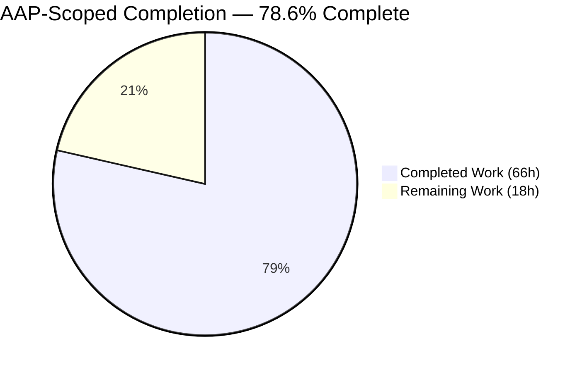
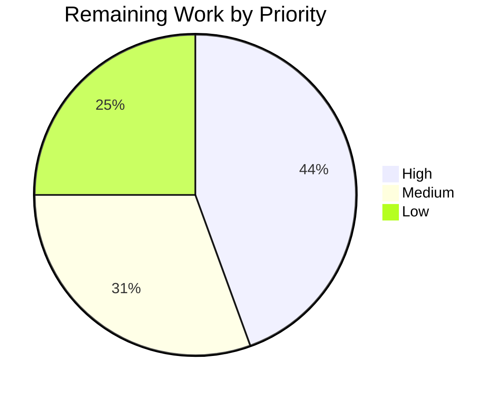

# 1. Executive Summary

## 1.1 Project Overview

`node-hello-world` is a self-contained Node.js tutorial project at the root of this repository. It exposes exactly one HTTP endpoint, `GET /hello`, returning the eleven-byte plain-text payload `Hello world` with status `200`. Its audience is a reader who clones the repository and wants a working server in two commands with no configuration; its value is instructional, showing the HTTP mechanics rather than hiding them behind a framework. Scope is narrow by design: a contract module over the runtime's core HTTP support, an entry point owning the port and process lifecycle, one test file, a manifest with **zero dependencies**, and a tutorial README that is itself a deliverable.

## 1.2 Completion Status



Colours follow the Blitzy palette: **Completed = Dark Blue `#5B39F3`**, **Remaining = White `#FFFFFF`**.

| Metric | Value |
|---|---|
| **Total Hours** | **84** |
| **Completed Hours (AI + Manual)** | **66** (66 AI + 0 manual) |
| **Remaining Hours** | **18** |
| **Percent Complete** | **78.6%** |

`66 / (66 + 18) × 100 = 78.6%`, scoped to Agent Action Plan deliverables plus the path-to-production work to publish them.

## 1.3 Key Accomplishments

- ✅ `GET /hello` returns exactly `Hello world` — 11 bytes, no trailing newline, byte-verified on the wire
- ✅ One endpoint only: over 40 other targets, `/health` and `/metrics` included, answer `404`
- ✅ All three responses carry `text/plain; charset=utf-8`, a body-derived `Content-Length`, `nosniff` and `no-store`
- ✅ Other methods answer `405` with `Allow: GET, HEAD`; `CONNECT` is refused, not dropped
- ✅ Zero dependencies: `npm ls --all` prints `(empty)` and installing creates no `node_modules`
- ✅ `PORT` is validated whole-value; the readiness line names the port actually bound
- ✅ Startup failures read as sentences; both signals drain in-flight work and exit `0`
- ✅ Three automated cases pass, and every tutorial command produces the output it claims

## 1.4 Critical Unresolved Issues

| Issue | Impact | Owner | ETA |
|---|---|---|---|
| The process entry point has no automated coverage — `PORT` validation, the readiness line, bind diagnostics and shutdown are proved only by manual checks | A regression in any of them leaves `npm test` green | Backend engineer | 5.0h |
| `HEAD /hello` and the `CONNECT` refusal are exercised at runtime but by no automated case (`src/server.js` lines 132-134, 196-209, 232-251) | Both behaviours are unguarded against future edits | Backend engineer | Included above |
| The route and payload literals are not independently pinned — the test oracle imports `HELLO_PATH` and `HELLO_BODY` from the module under test | Changing either moves expectation and implementation together and the suite stays green | Backend engineer | 1.5h |
| Three specification departures await a human decision: the request-target matching rule, the `CONNECT` answer, and the tutorial's layout disclosure (Section 5.2) | The delivered behaviour is correct but differs from what was agreed | Tech lead | 3.0h |
| The tutorial's toolchain advisory is anchored to a fixed date and names specific bundled library versions and CVE identifiers | The numbers age; a reader trusting a stale threshold may believe they are clear when they are not | Maintainer | 1.0h |
| The `EACCES` startup message is not reproducible in a default container, where unprivileged low-port binding is permitted | The branch is present and its text matches the tutorial, but it cannot be demonstrated here | Backend engineer | Verify in a restricted environment |
| No pipeline runs the suite, and there is no `LICENSE` file | A regression reaches the default branch unchallenged; the package cannot be published as-is | DevOps engineer | 4.0h |

## 1.5 Access Issues

**No access issues identified.** Validated now: the npm registry answers although nothing needs fetching; `npm ci` completes deterministically with the manifest and lockfile unchanged; the git remote is configured and the branch is in sync with its upstream. The project needs no credentials, no secrets and no environment file — only the optional `PORT`.

## 1.6 Recommended Next Steps

1. **[High]** Settle the three open specification departures in Section 5.2 and record the outcome (3.0h).
2. **[High]** Cover the entry point and the uncovered contract branches (5.0h).
3. **[Medium]** Run `npm ci` and `npm test` on every push through a pipeline (3.0h).
4. **[Medium]** Add a `LICENSE` file and publication metadata (1.0h).
5. **[Low]** Assert the route and payload literals against hard-coded expectations (1.5h).

# 2. Project Hours Breakdown

## 2.1 Completed Work Detail

| Component | Hours | Description |
|---|---|---|
| HTTP contract module — `src/server.js` | 14 | Ten functions over the core HTTP module: the route, payload and allowed-method constants; a header builder that derives `Content-Length` from the body it is about to write; request-target resolution and trailing-slash normalisation; the `200`, `404` and `405` writers with guard-clause routing; an explicit `CONNECT` refusal; and an import-safe `createServer()` factory that binds nothing. 279 lines. |
| Process entry point — `index.js` | 9 | Whole-value `PORT` validation with an escaped, single-line warning and a documented fallback; an ISO-timestamped readiness line naming the port read back from the bound socket; `EADDRINUSE`, `EACCES` and generic bind diagnostics in plain language with a non-zero status; and an exactly-once graceful shutdown on `SIGINT` and `SIGTERM`. 197 lines. |
| Automated test suite — `tests/hello.test.js` | 5 | Three cases on the runtime's built-in runner and strict assertion module using the global `fetch`: the success contract, the unknown-path `404` and the disallowed-method `405` with its `Allow` header. Fixture binds an ephemeral loopback port, every hook and case carries a five-second deadline, every request carries the case's abort signal, and teardown closes both the server and any open connection. 152 lines. |
| Package manifest, lockfile and ignore rules | 2 | `package.json` declaring identity, `main`, the `start` and `test` scripts, the `>=24.0.0` engine floor, the MIT licence and two empty dependency objects; a `lockfileVersion 3` lockfile with a root-only package map, tracked so installs are deterministic; and three ignore patterns keeping generated state out of version control. |
| Tutorial documentation — `README.md` | 9 | Ten sections replacing the previous two-line placeholder: overview, features, prerequisites, installation, both run forms, a verification walkthrough, the endpoint reference table, configuration, the test command and the project layout. Fourteen copy-pasteable commands and eleven quoted output transcripts, each compared against a real run. 282 lines. |
| Acceptance verification of the delivered contract | 16 | Syntax and install checks; the automated suite; positive and negative HTTP matrices spanning roughly 70 request targets and nine methods across six independent client stacks; byte-exactness of the payload by `od`, `wc` and `cmp`; a 22-value `PORT` matrix; lifecycle verification covering both signals, in-flight drain, repeated signals and socket release; the untouched-content regression guard; and every documented command re-executed against its claimed output. |
| Adversarial, security and browser verification | 11 | Injection batteries across query strings, paths, headers and request bodies; raw-wire parser probes for smuggling, CRLF injection and desync; concurrency bursts; log-injection probes covering control characters and bidirectional overrides; a supply-chain review of the install path; and headless-browser passes confirming the rendered payload by codepoint, the response headers on the wire, and a clean console. |
| **Total Completed** | **66** | |

## 2.2 Remaining Work Detail

| Category | Hours | Priority |
|---|---|---|
| Ratify or realign the three open specification departures — the request-target matching rule, the `CONNECT` answer, and the tutorial's layout disclosure | 3.0 | High |
| Automated regression coverage for the entry point and the uncovered contract branches (`PORT` validation, bind diagnostics, shutdown, `HEAD`, `CONNECT`) | 5.0 | High |
| Independent pinning of the route and payload literals in the test oracle | 1.5 | Medium |
| Continuous integration running `npm ci`, the suite and the documented acceptance commands on every push | 3.0 | Medium |
| `LICENSE` file and publication metadata | 1.0 | Medium |
| Origin-form projection decision for absolute-form request targets behind a forward proxy | 2.0 | Low |
| Refresh cycle for the time-anchored toolchain advisory in the tutorial | 1.0 | Low |
| Reader-environment smoke pass on a non-POSIX shell | 1.5 | Low |
| **Total Remaining** | **18.0** | |

## 2.3 Hours Reconciliation

| Check | Result |
|---|---|
| Section 2.1 total | 66h |
| Section 2.2 total | 18.0h |
| Section 2.1 + Section 2.2 | 84h — matches Total Hours in Section 1.2 |
| Completion percentage | `66 / 84 × 100 = 78.6%` — the figure used in Sections 1.2, 7 and 8 |
| Confidence | **High** for the delivered components and the verification effort, both sized against measured line counts and observed check volumes. **Medium** for continuous integration and the specification decisions, whose cost depends on choices a human still owns. |

# 3. Test Results

Every row below was executed against the tracked tree and its result observed directly. The automated suite is the whole of what runs unattended; the remaining rows are the acceptance checks a human runs from the tutorial, and their counts are the checks actually performed.

| Area / Category | Framework | Tests | Passed | Failed | Coverage | What This Proves |
|---|---|---|---|---|---|---|
| Automated endpoint contract | `node:test` + `node:assert/strict` | 3 | 3 | 0 | `src/server.js` 86.02% line / 76.47% branch / 80.00% funcs | The three answers the endpoint gives — `200` with the exact payload as plain text, `404` for an unknown path, `405` with `Allow` for a disallowed method — hold on every run |
| Static and install verification | `node --check`, npm | 7 | 7 | 0 | 3 of 3 sources | The sources parse, the manifest and lockfile agree, and a fresh install resolves zero packages with zero vulnerabilities and no `node_modules` |
| Positive HTTP path | curl, `od`, `wc`, raw socket | 11 | 11 | 0 | `/hello` and its three accepted spellings | The payload is byte-exact with the four contract headers, and `HEAD` returns the same headers with no body |
| Negative HTTP path — targets and methods | curl `--path-as-is`, raw socket | 15 | 15 | 0 | root, unknown, cased, nested and dot-segment targets; 6 ordinary methods plus `CONNECT` | The endpoint has exactly one address, and every disallowed method gets `405` with `Allow: GET, HEAD` — including `CONNECT`, which receives a real response rather than a dropped connection |
| Configuration and startup diagnostics | Spawned-process probes | 4 | 4 | 0 | default, override, rejected value, occupied port | `PORT` is honoured when usable and reported when not, and a busy port produces one plain sentence and status `1` with no stack trace |
| Process lifecycle | Signal probes | 2 | 2 | 0 | `SIGINT` and `SIGTERM` | Both signals log a receipt, drain, log completion and exit `0`, releasing the socket |
| Untouched-content regression guard | git, python3 | 2 | 2 | 0 | the pre-existing root script | The repository's earlier Python example is byte-identical and still behaves exactly as before |
| **Totals** | | **44** | **44** | **0** | | |

### Not Covered

These capabilities are delivered and were confirmed at runtime, but no automated test exercises them. Each should be checked by hand before a release until a case exists.

- **The whole of `index.js`.** The suite imports the server factory, not the entry point, so this file never appears in the coverage output. `PORT` resolution and its rejection path, the readiness line, the `EADDRINUSE`/`EACCES`/generic bind branches and the shutdown handler have no automated guard.
- **`HEAD /hello`** — the shared success branch at `src/server.js` lines 132-134.
- **The `CONNECT` refusal** — the raw-socket serialiser and handler at `src/server.js` lines 196-209 and 232-251, including the socket error guard, which no check has driven.
- **Trailing-slash normalisation** — the loop at `src/server.js` lines 78-79 is reached only by `/hello/` and `/hello//`, which the suite does not request.
- **The exact `Content-Length` and charset on the success response.** The automated case matches the content type against a `text/plain` prefix; the exact `11` and `; charset=utf-8` are confirmed only by the tutorial's `curl -i` and `od -c` steps.
- **The two contractual literals.** The oracle imports `HELLO_PATH` and `HELLO_BODY` from the module it tests, so a change to either leaves the suite green. Fault injection across the contract confirmed this precisely: seven of nine injected regressions were caught with exact assertion diffs, and the two that were not are these literals.
- **The `EACCES` startup message.** Its text matches the tutorial character for character, but a default container permits unprivileged low-port binding, so the branch cannot be provoked here.

# 4. Runtime Validation &amp; UI Verification

The service was started and driven for real — over a terminal client, over raw TCP sockets and in a headless browser. Status keys: ✅ Operational | ⚠ Partial | ❌ Failing.

- ✅ **Start-up** — `node index.js` and `npm start` both bind and print one line: `[2026-08-12T01:37:34.189Z] Listening on http://localhost:3456/hello`. The port named is read back from the bound socket, so `PORT=0` announces the port the operating system actually granted.
- ✅ **`GET /hello`** — `HTTP/1.1 200 OK` with `Content-Type: text/plain; charset=utf-8`, `Content-Length: 11`, `X-Content-Type-Options: nosniff`, `Cache-Control: no-store` and the body `Hello world`. `od -c` terminates at octal `0000013` and `wc -c` reports 11.
- ✅ **Accepted spellings** — `/hello`, `/hello/`, `/hello//` and `/hello?a=1` all return the identical body; no redirect is issued and the double slash reaches the server intact.
- ✅ **`HEAD /hello`** — `200` with the same headers, `Content-Length: 11` describing the resource, and zero body bytes downloaded.
- ✅ **Unknown targets** — `/`, `/nope`, `/HELLO`, `/hello/world` and the dot-segment forms `/x/../hello`, `/./hello`, `/hello/%2e` sent verbatim all return `404 Not Found` with a 9-byte body. The requested path is never reflected.
- ✅ **Disallowed methods** — `POST`, `PUT`, `DELETE`, `PATCH`, `OPTIONS` and `TRACE` on the route each return `405 Method Not Allowed` with `Allow: GET, HEAD` and an 18-byte body. The same methods on an unknown target return `404`, never a `405` with an `Allow` header on a resource that does not exist.
- ✅ **`CONNECT` over a raw socket** — `CONNECT /hello` returns `405` with `Allow: GET, HEAD`, `Content-Length: 18`, `Date` and `Connection: close`; `CONNECT /nope` returns `404`. No tunnel is opened and the socket closes after the response flushes.
- ✅ **Configuration and diagnostics** — `PORT=8091` binds 8091 and serves `200`. `PORT=not-a-number` writes `Invalid PORT "not-a-number"; falling back to 3000.` to standard error and the readiness line for 3000 to standard output. A second instance on an occupied port writes `Port 8091 is already in use.` and exits `1` with no stack frame anywhere in its output.
- ✅ **Shutdown** — `SIGTERM` and `SIGINT` each print `Received <signal>, closing server.` then `Server closed.` and exit `0`; the socket is released and immediately rebindable. Work in flight is genuinely drained before the second line appears.
- ✅ **Browser rendering** — a headless browser navigating to `/hello` rendered exactly `Hello world`, verified per codepoint as `[72,101,108,108,111,32,119,111,114,108,100]`, with `document.contentType` of `text/plain`, no `X-Powered-By`, and no application console message. `/` rendered the server's own 9-byte `Not Found` rather than a browser interstitial, and in-page `POST`/`DELETE` requests returned `405` with `Allow: GET, HEAD`.

**Not exercised at runtime.** The `EACCES` startup branch was never triggered in this environment, which permits unprivileged binding to low ports; its message text matches the tutorial exactly but the path itself is unproven here. There is no user interface to verify beyond the plain-text response above — the project ships no HTML, stylesheet or client-side script, and the browser pass exists only to confirm what a real client receives on the wire.

# 5. Compliance &amp; Quality Review

## 5.1 Compliance Matrix

Each row states where the deliverable stands now, against the requirement it answers.

| # | Requirement | Deliverable | Status | Evidence |
|---|---|---|---|---|
| R-1 | An npm-recognised project with a declared entry point and a runnable start command | `package.json`, `package-lock.json` | ✅ Pass | `main` is `index.js`; `npm run` lists exactly `start` and `test`; install and `npm ci` both exit 0; the runtime satisfies `engines.node >=24.0.0` |
| R-2, R-5 | An HTTP server accepts a client over TCP and answers with a success status | `src/server.js`, `index.js` | ✅ Pass | Full request/response cycles completed from a terminal client, a raw socket and a browser; `HTTP/1.1 200 OK` on every accepted spelling, stable under concurrent load |
| R-3 | Exactly one endpoint, at `/hello` | `src/server.js:111,160` | ✅ Pass | One route constant, one equality; over 40 other targets answer `404`, including `/health` and `/metrics` |
| R-4, R-8 | The body is exactly `Hello world` — 11 bytes, no trailing newline — with a correct plain-text content type | `src/server.js:28,55` | ✅ Pass | `od -c` ends at octal `0000013`; `wc -c` is 11; the digest equals `printf 'Hello world'`; `text/plain; charset=utf-8` with a body-derived `Content-Length` on all three shapes |
| R-6, R-15 | The tutorial is a functional deliverable, and the previous README is replaced | `README.md` | ✅ Pass | The two-line placeholder is gone; ten sections, all 14 commands executed and all 11 quoted transcripts matched |
| R-7 | A port is chosen and changeable without editing source | `index.js:74` | ✅ Pass | Default 3000, `PORT` override, whole-value validation with a warning and fallback across 22 measured values |
| R-9, R-10 | Non-matching paths and disallowed methods each receive a defined response, with `Allow` on the latter | `src/server.js:139,152,232` | ✅ Pass | 9-byte `Not Found` with no reflection of the requested path; `405` plus `Allow: GET, HEAD` for ordinary methods, non-standard tokens and `CONNECT` |
| R-11 | The process terminates cleanly on `SIGINT` and `SIGTERM` | `index.js:121` | ✅ Pass | Two stamped lines and exit `0`; in-flight work drained; a later signal falls through to the runtime's default action |
| R-12 | Startup failures are legible rather than an opaque stack trace | `index.js:155` | ✅ Pass | `EADDRINUSE` and generic branches reproduced with exit `1` and zero stack frames; the `EACCES` branch is present but not reproducible here (Section 3) |
| R-13 | Generated state is never committed | `.gitignore` | ✅ Pass | Exactly `node_modules/`, `*.log`, `.env`; sentinel files confirmed ignored while every source path stays tracked |
| R-14 | The requirement is provable without manual inspection, using runtime built-ins only | `tests/hello.test.js` | ✅ Pass | 3 cases, 3 passing, exit 0, zero packages loaded; residual coverage gaps are listed in Section 3 |
| Rule 1 | Make minimal changes — confine changes to scope, add no dependency, refactor nothing opportunistically | Whole tree | ✅ Pass | 7 changed paths, all authorised; the pre-existing Python script byte-identical; both dependency objects empty; two scripts; one route; three status codes; no linter, container, pipeline or editor configuration added |

## 5.2 AAP &amp; Rule Divergences and Gaps

Six departures from the Agent Action Plan are on record. None is a Rule 1 breach and none leaves the product incorrect — in four cases the plan's prescribed *mechanism* was set aside to satisfy a higher-priority *requirement* in the same plan, and in two cases the tutorial carries content beyond its agreed section list. All six are stated so the reader can ratify or reverse them deliberately.

| What the AAP/Rule Required | What Was Delivered Instead | Why It Diverged | Impact | Remediation |
|---|---|---|---|---|
| §0.6.5.3 / §0.7.1 / §0.4.1: resolve the pathname with the `URL` constructor against the request's `Host` header, with a raw `split('?')` fallback | The raw request target, cut at the first `?`, then trailing-slash normalisation; `URL` is not used anywhere in the module (`src/server.js:111-116`) | The prescribed mechanism contradicted the plan's own cardinality requirement | Positive for ordinary clients; absolute-form targets now answer `404` | Ratify the rule in the specification, or add an origin-form projection (2.0h) |
| §0.7.1 / §0.7.2: `src/server.js` is the core HTTP import, the contract constants, one request listener and an exported factory | Two further functions and one further listener: `serialiseResponse()`, `handleConnect()` and `server.on('connect', …)` inside the factory (`src/server.js:196,232,266`) | Without them a `CONNECT` request received no response at all | Positive; only `404` and `405` are ever emitted, no tunnel is opened, the factory stays import-safe | Ratify the two functions and the sixth endpoint-table row (part of 3.0h) |
| The `index.js` detail spells the exits as `process.exit(1)` and `process.exit(0)` | `process.exitCode` is set and the event loop left to drain; there is no `process.exit(` call in the file (`index.js:149,173`) | A forced exit can discard diagnostics still queued on a pipe | None — exit statuses `0` and `1` are unchanged and re-measured | None required |
| The `index.js` schema note says parse `PORT` with `Number.parseInt(raw, 10)` | The whole value must match `/^\d+$/` before conversion, then `Number.isSafeInteger` and a 65535 ceiling apply (`index.js:26,74-99`) | `parseInt` returns a leading prefix, which contradicted the plan's own stated rule | Strictly better; one edge changed — `" 3000"` and `"+3000"` now warn and fall back | None required |
| §0.7.3 fixes the tutorial's section list, which contains no toolchain or supply-chain guidance | Prerequisites carries three paragraphs and a command block naming the bundled `tar` and `brace-expansion` versions with three CVE identifiers, anchored to a fixed date (`README.md:26-34`) | A clean project audit does not cover the package manager's own bundled libraries, and the tutorial tells the reader to run it | Accurate today; the version numbers and thresholds will age | Keep it on a refresh cycle, or reduce it to the method without the numbers (1.0h) |
| The `README.md` specification forbids documenting, mentioning or listing the pre-existing Python script anywhere, and makes a zero match count an acceptance criterion | The project-layout tree lists it and an explanatory bullet describes it — two mentions (`README.md:270,282`) | The diagram is rooted at `.`, so it disagreed with a fresh clone | The diagram now matches `git ls-files` exactly; the file itself is still untouched | Choose one: keep the disclosure and lift the exclusion, or relabel the diagram (part of 3.0h) |

**Request-target matching.** The plan asked for the `URL` constructor, and that is exactly what cannot be used here. WHATWG parsing rewrites what it reads: it resolves `.` and `..` segments and their percent-encoded spellings, discards a fragment, and flattens an absolute target to the path inside it. Routing on the result gave the one endpoint extra addresses — `/x/../hello`, `/./hello`, `/hello/.`, `/hello/%2e`, an absolute-form target and `/hello#frag` each answered `200`. That contradicts reading "one end point" as a cardinality limit verified by "every other path returns 404". The delivered rule reads `req.url` directly (`src/server.js:111`) and keeps query-string independence, so `/hello?a=1` still succeeds. Ratify it; the alternative reopens seven addresses.

**The `CONNECT` answer.** `CONNECT` never reaches a request listener. The runtime emits it on the server's own `connect` event with a raw socket and destroys the connection when nothing is listening, so a client asking `CONNECT /hello` or `CONNECT host:443` received zero bytes and a closed socket — and silence is precisely the failure the method-handling requirement exists to prevent. `handleConnect()` applies the same two rules over the socket: `405` with `Allow: GET, HEAD` on the route, `404` elsewhere, no tunnel, with an error guard attached before the write so a client vanishing mid-write cannot end the process (`src/server.js:232-251`). It emits no new status code, so the three-shape constraint holds. What needs ratifying is the file's contents, not its behaviour.

**Exit mechanism.** Setting `process.exitCode` instead of calling `process.exit()` looks like a detail and is not. A write to a pipe is asynchronous, and a forced exit races it: measured on this runtime, an exit immediately after a 200,000-byte pipe write delivered only 65,536 bytes. The two messages most likely to be captured to a file or read by a supervisor — the port-in-use sentence and the shutdown pair — were the ones at risk. The plan's acceptance criteria assert the exit *status*, not the call, and both statuses are unchanged: `0` after a clean close, `1` after a bind failure, each re-measured (`index.js:149,173`).

**`PORT` parsing.** `Number.parseInt` stops at the first character it cannot use and returns the prefix, so the range check that followed was inspecting an already-corrupted value: `3000abc` bound 3000, `1.5` and `1e3` bound port 1, `0x10` bound an operating-system-chosen port — all silently. That contradicts the plan's own stated rule that a non-numeric value produces a warning. The delivered code validates the complete string against `/^\d+$/` and only then converts, which also removes the base ambiguity `Number` alone would introduce (`index.js:26,74-99`). One edge follows: values with surrounding whitespace or a leading `+` now warn and fall back rather than being coerced.

**Toolchain advisory in the tutorial.** The tutorial's section list is fixed, and this content sits outside it. It is there because a reader runs `npm install`, sees `found 0 vulnerabilities`, and can reasonably conclude the whole toolchain is clear — when that audit describes this project's dependency tree, empty by design, and says nothing about the package manager's own bundled libraries. The delivered text gives commands to read the reader's own installed versions rather than trusting a frozen number (`README.md:26-34`). That instinct is right, but the passage names specific versions, CVE identifiers and a fixed date, so it decays. Decide whether the tutorial should carry it; if so, keep only the method or schedule a refresh.

**The pre-existing Python script in the layout.** The specification is explicit that this file must not be documented, mentioned or listed anywhere, and makes a zero match count an acceptance criterion; the script is outside the project's scope and is left byte-identical. Against that, the layout diagram is rooted at `.`, so a reader comparing it with a fresh clone found a tracked file with a test-like name in a project that claims one test file. The delivered diagram lists all eight tracked paths and a bullet marks the script as no part of the tutorial (`README.md:270,282`). Both positions are defensible and mutually exclusive: lift the exclusion and keep the disclosure, or relabel the diagram and remove both mentions.

# 6. Risk Assessment

These are forward-looking exposures — what could still go wrong once this code is in someone else's hands.

| Risk | Category | Severity | Probability | Mitigation | Status |
|---|---|---|---|---|---|
| The entry point and several contract branches carry no automated coverage, so a future edit to `PORT` handling, bind diagnostics, shutdown, `HEAD` or `CONNECT` leaves `npm test` green | Technical | Medium | Medium | Add cases for the entry point and the uncovered branches, or gate changes to `index.js` on re-running the documented acceptance commands | Open |
| The route and payload literals are not independently pinned — the oracle imports them from the module under test, so changing either keeps the suite green | Technical | Medium | Low | Assert both against hard-coded expectations, or keep the byte-exactness step in the release routine | Open |
| Nothing runs the suite automatically, so a regression can reach the default branch unchallenged | Operational | Medium | Medium | A minimal pipeline running `npm ci` then `npm test`; the suite is deterministic, exit-code correct and finishes in about 0.3 s | Open |
| The listener binds every interface — `listen` is called without a host and the design permits exactly one setting, the port — so the endpoint answers on non-loopback addresses too | Security | Low | Medium | Restrict with a firewall or network policy. The response is a constant and no request data is read, so there is nothing to extract, but an open port is still an open port | Accepted |
| The tutorial's toolchain advisory names specific bundled library versions, CVE identifiers and a fixed date, so a reader may trust a stale clearance threshold | Security | Low | High | The text already directs the reader to check their own installation against current advisories; put it on a refresh cycle or reduce it to the method | Open |
| Absolute-form request targets answer `404`, where the HTTP specification asks an origin server to accept them | Integration | Low | Low | No ordinary browser or terminal client sends that form to an origin. Decide an origin-form projection before placing the service behind a forward proxy that passes it through | Open |
| Signalling only the package script leaves the runtime child running, reparented and still holding the port | Operational | Low | Medium | Use `node index.js` as the entry point for process managers and containers; the tutorial documents this and a terminal Ctrl+C is safe either way | Accepted |
| A stalled client can hold graceful shutdown open until the runtime's header timeout — roughly a minute — before the process exits | Operational | Low | Low | A second signal terminates immediately; a supervisor should allow a grace period or escalate | Accepted |

Beyond these, the classic integration risks have no surface here: the project has no database, cache, queue, outbound call, credential or third-party package, so there is nothing to mock, nothing to rotate and no dependency advisory to track in its own tree.

# 7. Visual Project Status

**Overall progress — 78.6% complete.** Completed = Dark Blue `#5B39F3`; Remaining = White `#FFFFFF`.


**Remaining work by priority** — 8.0h High, 5.5h Medium, 4.5h Low, totalling 18.0h.



**Where the remaining 18.0 hours sit**

| Category | Hours | Share of remaining |
|---|---|---|
| Automated regression coverage for the entry point and uncovered branches | 5.0 | 27.8% |
| Ratifying the three open specification departures | 3.0 | 16.7% |
| Continuous integration | 3.0 | 16.7% |
| Origin-form projection decision | 2.0 | 11.1% |
| Independent pinning of the contract literals | 1.5 | 8.3% |
| Non-POSIX shell smoke pass | 1.5 | 8.3% |
| `LICENSE` file and publication metadata | 1.0 | 5.6% |
| Toolchain advisory refresh | 1.0 | 5.6% |
| **Total** | **18.0** | **100%** |

**Delivery footprint**

| Measure | Value |
|---|---|
| Files created | 6 |
| Files modified | 1 |
| Files deliberately untouched | 1 |
| Lines added / removed | 953 / 2 |
| Runtime dependencies | 0 |
| Development dependencies | 0 |
| Endpoints exposed | 1 |
| Response shapes emitted | 3 |

# 8. Summary &amp; Recommendations

**What was delivered.** The repository now contains a complete, runnable Node.js tutorial project built entirely on the runtime's own capabilities. `GET /hello` answers with exactly `Hello world` — eleven bytes, verified on the wire rather than in the source — carrying `text/plain; charset=utf-8`, a `Content-Length` derived from the body itself, `nosniff` and `no-store`, and no header that discloses what is serving it. Every other request target answers `404`, every other method answers `405` with the mandatory `Allow`, and `CONNECT` is refused with a real response instead of a dropped connection. The entry point validates `PORT` whole-value, announces the port it actually bound, translates bind failures into single sentences with a non-zero status, and shuts down cleanly on both termination signals. The dependency surface is literally empty: installing resolves zero packages, creates no `node_modules` and reports zero vulnerabilities. Seven files were added or rewritten and the repository's pre-existing Python example was left byte-identical.

**What was verified.** Three automated cases pass on the built-in runner with no packages installed, and they are the only thing that runs unattended. Around them sits a substantial body of executed acceptance work: positive and negative HTTP matrices across roughly seventy request targets and nine methods through six independent client stacks, byte-exactness proved three ways, a twenty-two-value `PORT` matrix, lifecycle checks covering both signals and in-flight drain, injection and raw-wire parser batteries that produced a constant response with no reflection and no injected header, and headless-browser passes that confirmed the rendered payload by codepoint with a clean console. Every command printed in the tutorial was executed and compared against the output the document claims for it. Fault injection across the contract caught seven of nine deliberately introduced regressions with exact assertion diffs, which is the clearest available measure of how much the green suite is worth.

**The gaps that remain.** The most consequential is coverage, not correctness. The suite exercises the contract module and never touches the entry point, so port handling, diagnostics and shutdown are protected by manual checks rather than by anything that runs on a push — and `HEAD`, the `CONNECT` refusal and trailing-slash normalisation sit in the contract module's uncovered lines. The two contractual literals are asserted against the module's own constants, so a change to either would not turn the suite red. Six departures from the plan are documented in Section 5.2. Two need no action: the exit mechanism and the port parser are both safer than what was specified and change no observable status. Three are open for a decision, and one is an editorial choice about how long the tutorial's toolchain advisory should live. Reversing either of the two behavioural departures would reintroduce the defect it was chosen to close, so the real question is whether to record them in the specification. Nothing here blocks a reader from cloning, starting and verifying the project today.

**The critical path to production.** For this project, "production" means a repository someone else can trust and, optionally, a published package. Four things stand between here and there: settle the open departures so specification and code agree; put automated coverage under the entry point and the uncovered branches so regressions surface without a human; add a pipeline; and add a `LICENSE` file. That is 13 of the 18 remaining hours. The residual five — literal pinning, the origin-form decision and a non-POSIX shell pass — are conditional or maintenance work that can follow.

**Production readiness assessment.** The project is **78.6% complete** against its planned scope and path to production, with 66 of 84 hours delivered. Functionally it is ready: every requirement in the plan is implemented and demonstrated, the acceptance criteria reproduce, and the failure modes a first-time reader will actually hit — an occupied port, a mistyped `PORT`, pressing Ctrl+C — are handled and documented. What it is not yet is *maintainable without vigilance*, because the safety net under the entry point is manual. Success metrics for the remaining work are concrete and easy to check: `npm test` reports more than three cases and lists the entry point in its coverage output; a mutated payload or route literal turns the suite red; a pipeline run appears on every push; `git ls-files` includes a `LICENSE`; and the specification and the code no longer disagree on the points in Section 5.2.

# 9. Development Guide

Every command in this section was executed against the tracked tree and produced the output shown.

## 9.1 System Prerequisites

| Requirement | Version | Notes |
|---|---|---|
| Node.js | **24.19.0** (any `>=24.0.0`) | Active LTS. The manifest declares the floor in `engines.node`; nothing enforces it at run time, so choose the runtime deliberately |
| npm | **11.17.0** | Ships with the runtime. Used only to dispatch the two scripts and to write the lockfile |
| Operating system | Any POSIX-like system | The examples below assume a POSIX shell and `curl`; `od` is optional and used only for the byte check |
| Disk / memory | Negligible | The tracked tree is roughly 45 KB and nothing is downloaded |

No database, cache, message queue, container runtime, credential or environment file is required.

```bash
# Confirm the toolchain before anything else
node --version    # -> v24.19.0
npm --version     # -> 11.17.0
```

## 9.2 Environment Setup

There is nothing to configure. The project reads exactly one optional environment variable.

```bash
# From the repository root
node -p "require('./package.json').engines.node"   # -> >=24.0.0

# Optional: choose a port other than the default 3000
export PORT=8081
```

`PORT` must be a decimal whole number from `0` to `65535` in its entirety. `0` asks the operating system to choose a free port, and the readiness line names the port it granted. Anything else — `1.5`, `1e3`, `0x10`, `3000abc`, `" 3000"`, `+3000`, `65536`, `-1` — is reported and the server falls back to 3000.

## 9.3 Dependency Installation

```bash
# From the repository root. Nothing is fetched: both dependency objects are empty.
npm install
```

Observed output:

```text
up to date, audited 1 package in 120ms

found 0 vulnerabilities
```

No `node_modules` directory is created — not even an empty one. `npm ci` is the deterministic equivalent and leaves the manifest and lockfile byte-unchanged. To prove the dependency surface for yourself:

```bash
npm ls --all      # -> node-hello-world@1.0.0 <path>  /  └── (empty)
npm audit         # -> found 0 vulnerabilities
```

There is no build step. `npm run build` correctly reports `Missing script: "build"` and exits `1`; the runtime executes the source directly.

## 9.4 Application Startup

Two equivalent forms. Prefer the direct one whenever a process manager or container will be sending signals.

```bash
# Direct — recommended for anything that signals the process
node index.js

# Through the package script
npm start
```

Observed output, one line:

```text
[2026-08-12T01:45:38.653Z] Listening on http://localhost:3000/hello
```

```bash
# A different port
PORT=8081 node index.js
# -> [2026-08-12T01:37:51.992Z] Listening on http://localhost:8081/hello
```

Stop the server with Ctrl+C, or by sending `SIGTERM`:

```text
[2026-08-12T01:45:39.649Z] Received SIGINT, closing server.
[2026-08-12T01:45:39.649Z] Server closed.
```

The process exits `0` and releases the socket immediately. Requests already in flight are answered before the second line appears.

## 9.5 Verification Steps

```bash
# Step 1 — syntax. Silent on success.
node --check index.js
node --check src/server.js
node --check tests/hello.test.js

# Step 2 — the automated suite
npm test
```

Observed output:

```text
✔ GET /hello responds 200 with the exact payload as plain text (27.755ms)
✔ GET / responds 404 (2.381ms)
✔ a disallowed method on /hello responds 405 and advertises what is allowed (1.776ms)
ℹ tests 3
ℹ pass 3
ℹ fail 0
```

`npm test; echo $?` prints `0`. The suite binds an ephemeral loopback port, so it passes even while a server holds 3000.

```bash
# Step 3 — optional coverage, with no tool installed
node --test --experimental-test-coverage
# -> src/server.js  86.02 line | 76.47 branch | 80.00 funcs
```

## 9.6 Example Usage

With the server running on 3000:

```bash
# The endpoint, with headers
curl -i http://localhost:3000/hello
```

```text
HTTP/1.1 200 OK
Content-Type: text/plain; charset=utf-8
Content-Length: 11
X-Content-Type-Options: nosniff
Cache-Control: no-store

Hello world
```

```bash
# Byte-exactness — eleven bytes, no trailing newline
curl -s http://localhost:3000/hello | od -c
```

```text
0000000   H   e   l   l   o       w   o   r   l   d
0000013
```

```bash
# Headers only; the body is empty as HTTP specifies for HEAD
curl -sI http://localhost:3000/hello

# Any other path
curl -s -o /dev/null -w '%{http_code}\n' http://localhost:3000/     # -> 404

# Any other method
curl -i -X POST http://localhost:3000/hello                          # -> 405, Allow: GET, HEAD

# Accepted spellings of the one endpoint
curl -s http://localhost:3000/hello/                                 # -> Hello world
curl -s http://localhost:3000/hello//                                # -> Hello world
curl -s 'http://localhost:3000/hello?a=1'                            # -> Hello world
```

## 9.7 Troubleshooting

| Symptom | Cause | Resolution |
|---|---|---|
| `Port 3000 is already in use.` and exit status `1` | Another process holds the port | Stop it, or start on another port: `PORT=8081 node index.js`. No stack trace is printed — the sentence is the whole diagnostic |
| `Invalid PORT "<value>"; falling back to 3000.` on standard error | The whole value is not a decimal number from 0 to 65535 | Correct the value. The server has already started on 3000; the readiness line on standard output confirms which port is live |
| `Insufficient permissions to bind to port <n>.` and exit `1` | Binding a privileged port as an unprivileged user | Choose a port above 1023, or grant the process the capability to bind low ports |
| `MODULE_NOT_FOUND` on start | The working directory is not the package root, or the clone is incomplete | Run from the root. `npm start` resolves the root itself; `node index.js` does not |
| `npm error Missing script: "build"` | Expected — there is no build step by design | Nothing to do. `npm run` lists the only two scripts: `start` and `test` |
| `npm warn EBADENGINE` during install | The runtime is below the declared floor | Install Node 24 or newer. npm warns and installs anyway unless `--engine-strict=true` is passed, and neither `npm start` nor `node index.js` checks the field |
| Stopping through `npm start` leaves the server running | Signalling only the script process does not stop the runtime child, which is reparented and keeps the port | Use `node index.js` for process managers and container entry points. A terminal Ctrl+C signals the whole group and is safe either way |
| `npm test` reports more than three cases | Test discovery is recursive from the package root, so any other `*.test.js` anywhere beneath it is swept in | Remove or relocate the extra file. A clean clone yields exactly three |
| Shutdown appears to hang after `Received <signal>, closing server.` | A client is holding a request open; closing waits for work in flight, bounded by the runtime's header timeout | Wait, or send a second signal — the handlers stand down after the first, so the second stops the process immediately |

# 10. Appendices

## A. Command Reference

| Purpose | Command | Expected result |
|---|---|---|
| Check the toolchain | `node --version && npm --version` | `v24.19.0` and `11.17.0` |
| Install | `npm install` | `audited 1 package`, `found 0 vulnerabilities`, no `node_modules` |
| Deterministic install | `npm ci` | Same, with the manifest and lockfile unchanged |
| Prove the dependency surface | `npm ls --all` | The package name followed by `└── (empty)` |
| Audit | `npm audit` | `found 0 vulnerabilities` |
| List the scripts | `npm run` | Exactly `start` and `test` |
| Syntax check | `node --check <file>` | Silent, exit `0` |
| Start (direct) | `node index.js` | One ISO-timestamped readiness line |
| Start (script) | `npm start` | The script header, then the same readiness line |
| Start on another port | `PORT=8081 node index.js` | Readiness line naming 8081 |
| Run the tests | `npm test` | `tests 3`, `pass 3`, `fail 0`, exit `0` |
| Tests with coverage | `node --test --experimental-test-coverage` | The same result plus a coverage table |
| Request the endpoint | `curl -i http://localhost:3000/hello` | `200` with four contract headers and `Hello world` |
| Prove the byte count | `curl -s http://localhost:3000/hello \| od -c` | Ends at octal `0000013` |
| Headers only | `curl -sI http://localhost:3000/hello` | `200`, `Content-Length: 11`, empty body |
| Unknown path | `curl -s -o /dev/null -w '%{http_code}\n' http://localhost:3000/` | `404` |
| Disallowed method | `curl -i -X POST http://localhost:3000/hello` | `405` with `Allow: GET, HEAD` |
| Stop the server | Ctrl+C, or `kill -TERM <pid>` | Two shutdown lines, exit `0` |

## B. Port Reference

| Port | Used by | Notes |
|---|---|---|
| `3000` | Default HTTP listener | Plain text, no TLS. Also the documented fallback when `PORT` is unusable |
| Any `1`–`65535` | `PORT` override | The whole value must be decimal digits |
| `0` | `PORT=0` | Asks the operating system for a free port; the readiness line names the one granted |
| Ephemeral loopback | The automated suite | The fixture always binds port `0` on `127.0.0.1`, so it never collides with a running instance |

The listener is created without a host, so it answers on every interface, not only loopback. There is no host setting.

## C. Key File Locations

| Path | Role |
|---|---|
| `index.js` | Executable entry point named by `main` and by `scripts.start`. Owns `PORT` resolution, the readiness line, bind diagnostics and the signal handlers |
| `src/server.js` | The HTTP contract. Route, payload and allowed-method constants; header builder; request-target resolution; the `200`/`404`/`405` writers; the `CONNECT` refusal; the exported `createServer()` factory |
| `tests/hello.test.js` | The automated suite — three cases on the built-in runner over an ephemeral loopback port |
| `package.json` | Identity, `main`, the `start` and `test` scripts, keywords, MIT licence, the engine floor, and two empty dependency objects |
| `package-lock.json` | `lockfileVersion 3` with a root-only package map; tracked so installs are reproducible |
| `.gitignore` | Exactly three patterns: `node_modules/`, `*.log`, `.env` |
| `README.md` | The tutorial itself, and a functional deliverable rather than decoration |
| `test.py` | A pre-existing Python example that predates this project, deliberately untouched. It shares no code, configuration or data, and `node --test` never collects it |

## D. Technology Versions

| Component | Version | Source |
|---|---|---|
| Node.js | 24.19.0 | Active LTS line; the sole external prerequisite |
| npm | 11.17.0 | Bundled with the runtime |
| `node:http` | Ships with the runtime | Server creation, request and response objects |
| `node:test` | Ships with the runtime | The test runner |
| `node:assert/strict` | Ships with the runtime | Assertions |
| `fetch`, `Buffer`, `Object.freeze` | Runtime globals | HTTP client in the suite, byte-length computation, immutable method list |
| Runtime dependencies | **0** | `dependencies: {}` |
| Development dependencies | **0** | `devDependencies: {}` |
| Module system | CommonJS | No `"type": "module"`; no transpiler, bundler or minifier |

## E. Environment Variable Reference

| Variable | Required | Default | Accepted values | Behaviour when invalid |
|---|---|---|---|---|
| `PORT` | No | `3000` | The entire value must be decimal digits resolving to `0`–`65535`. `0` means "let the operating system choose" | One line on standard error: `Invalid PORT "<value>"; falling back to 3000.` The value is quoted and escaped, so a newline or terminal escape sequence cannot forge a second log line. The server then starts on `3000` |

No other environment variable is read. Unset and empty both fall back to `3000` silently. No secret, token or credential is used anywhere in the project.

## F. Developer Tools Guide

| Task | Tool | Invocation |
|---|---|---|
| Syntax validation | Runtime built-in | `node --check <file>` — this project ships no linter or formatter by design |
| Test execution | Runtime built-in | `npm test`, or `node --test tests/hello.test.js` for a single file |
| Coverage | Runtime built-in | `node --test --experimental-test-coverage` — no package required |
| Selective test runs | Runtime built-in | `node --test --test-name-pattern=404` |
| Alternative reporters | Runtime built-in | `node --test --test-reporter=tap` |
| Deprecation surfacing | Runtime flags | `node --throw-deprecation --pending-deprecation --test` |
| Lockfile regeneration | npm | Delete `package-lock.json` and run `npm install`; the result is byte-identical |
| Dependency proof | npm | `npm ls --all` and `npm audit` |

## G. Glossary

| Term | Meaning in this project |
|---|---|
| Contract module | `src/server.js` — the file that encodes the endpoint's path, payload, status codes and headers, and nothing about the process |
| Entry point | `index.js` — the file that resolves the port, binds it, reports failures and handles termination signals |
| Import-safe | Requiring the contract module binds no port and prints nothing; the factory returns an unbound server, which is what lets the suite bind an ephemeral port while a development instance holds 3000 |
| Factory | `createServer()` — returns a new, fully wired but unbound server on every call, rather than a shared singleton |
| Readiness line | The single line printed on a healthy start, carrying an ISO-8601 timestamp and the full endpoint URL with the port read back from the bound socket |
| Accepted spellings | `/hello`, `/hello/`, `/hello//` and `/hello?a=1` — the same one resource. Trailing slashes are normalised and a query string does not affect routing |
| Request target | The path exactly as the client put it on the wire. Matching is done against this rather than against a parsed and rewritten form, which is what holds the endpoint to a single address |
| Contract headers | `Content-Type: text/plain; charset=utf-8`, a body-derived `Content-Length`, `X-Content-Type-Options: nosniff` and `Cache-Control: no-store` — present on all three response shapes |
| Graceful shutdown | Stop accepting new connections, finish the requests already in flight, then exit `0` |
| Zero-dependency | Both dependency objects in the manifest are empty; installing fetches nothing and creates no `node_modules`; only runtime built-ins are used |
