# Technical Specifications

## 1. INTRODUCTION

### EXECUTIVE SUMMARY

| Aspect | Description |
|--------|-------------|
| Project Overview | A simple Node.js HTTP server application that exposes a single REST endpoint `/hello` which returns "Hello world" to clients |
| Business Problem | Provides a minimal, functional example of a Node.js web service that can serve as a learning tool or starter template |
| Key Stakeholders | Developers learning Node.js, technical trainers, software engineers requiring a baseline implementation |
| Value Proposition | Demonstrates fundamental Node.js web service concepts with minimal complexity, enabling rapid learning and implementation |

### SYSTEM OVERVIEW

#### Project Context

| Context Element | Description |
|-----------------|-------------|
| Business Context | Educational tool for Node.js server development fundamentals |
| Current Limitations | N/A - New implementation |
| Enterprise Integration | Standalone application with no external dependencies |

#### High-Level Description

| Component | Description |
|-----------|-------------|
| Primary Capabilities | HTTP request handling, REST endpoint implementation, response generation |
| Major Components | Node.js runtime, HTTP server module, route handler |
| Technical Approach | Lightweight implementation using Node.js core modules without external frameworks |

#### Success Criteria

| Criteria Type | Description |
|---------------|-------------|
| Measurable Objectives | 1. Server successfully starts and listens on configured port<br>2. `/hello` endpoint returns "Hello world" with 200 status code<br>3. Documentation enables new users to run the application |
| Critical Success Factors | 1. Code simplicity and readability<br>2. Proper error handling<br>3. Clear implementation documentation |
| Key Performance Indicators | 1. Response time under 100ms<br>2. Successful response rate of 100%<br>3. Zero unhandled exceptions |

### SCOPE

#### In-Scope

**Core Features and Functionalities**

| Feature | Description |
|---------|-------------|
| HTTP Server | Node.js HTTP server implementation |
| REST Endpoint | Single `/hello` endpoint returning "Hello world" |
| Response Format | Plain text response |
| Documentation | Setup and usage instructions |

**Implementation Boundaries**

| Boundary | Description |
|----------|-------------|
| System Boundaries | Self-contained Node.js application |
| User Groups | Developers and learners |
| Geographic Coverage | Not applicable - accessible wherever Node.js can be installed |
| Data Domains | No data persistence or external data sources |

#### Out-of-Scope

- Authentication and authorization mechanisms
- Multiple endpoints beyond `/hello`
- Database integration
- Logging infrastructure
- Production deployment configurations
- Performance optimization
- Frontend user interface
- API versioning
- Containerization
- Continuous integration/deployment pipelines

## 2. PRODUCT REQUIREMENTS

### FEATURE CATALOG

#### Feature Metadata

| ID | Feature Name | Feature Category | Priority Level | Status |
|----|--------------|------------------|----------------|--------|
| F-001 | HTTP Server | Core Infrastructure | Critical | Approved |
| F-002 | Hello Endpoint | API | Critical | Approved |
| F-003 | Server Configuration | Infrastructure | Medium | Approved |
| F-004 | Error Handling | Reliability | High | Approved |

#### Feature Descriptions

**F-001: HTTP Server**

| Aspect | Description |
|--------|-------------|
| Overview | A Node.js HTTP server that listens for incoming requests |
| Business Value | Provides the foundation for serving web content and API responses |
| User Benefits | Enables developers to understand basic HTTP server implementation in Node.js |
| Technical Context | Uses Node.js core 'http' module without external dependencies |

**F-002: Hello Endpoint**

| Aspect | Description |
|--------|-------------|
| Overview | REST endpoint at path '/hello' that returns "Hello world" text response |
| Business Value | Demonstrates basic API endpoint implementation |
| User Benefits | Provides a working example of request handling and response generation |
| Technical Context | Implemented as a route handler within the HTTP server |

**F-003: Server Configuration**

| Aspect | Description |
|--------|-------------|
| Overview | Configuration for server port and other runtime parameters |
| Business Value | Enables flexibility in deployment environments |
| User Benefits | Allows customization without code changes |
| Technical Context | Environment variables or configuration file based settings |

**F-004: Error Handling**

| Aspect | Description |
|--------|-------------|
| Overview | Basic error handling for server startup and request processing |
| Business Value | Improves reliability and troubleshooting |
| User Benefits | Provides clear feedback when issues occur |
| Technical Context | Try/catch blocks and appropriate HTTP status codes |

#### Dependencies

**F-001: HTTP Server**

| Dependency Type | Description |
|-----------------|-------------|
| Prerequisite Features | None |
| System Dependencies | Node.js runtime |
| External Dependencies | None |
| Integration Requirements | None |

**F-002: Hello Endpoint**

| Dependency Type | Description |
|-----------------|-------------|
| Prerequisite Features | F-001 HTTP Server |
| System Dependencies | None |
| External Dependencies | None |
| Integration Requirements | None |

**F-003: Server Configuration**

| Dependency Type | Description |
|-----------------|-------------|
| Prerequisite Features | F-001 HTTP Server |
| System Dependencies | None |
| External Dependencies | None |
| Integration Requirements | None |

**F-004: Error Handling**

| Dependency Type | Description |
|-----------------|-------------|
| Prerequisite Features | F-001 HTTP Server, F-002 Hello Endpoint |
| System Dependencies | None |
| External Dependencies | None |
| Integration Requirements | None |

### FUNCTIONAL REQUIREMENTS TABLE

**F-001: HTTP Server**

| Requirement ID | Description | Acceptance Criteria | Priority |
|----------------|-------------|---------------------|----------|
| F-001-RQ-001 | The system shall implement an HTTP server using Node.js core modules | Server starts successfully and listens for connections | Must-Have |
| F-001-RQ-002 | The server shall listen on a configurable TCP port | Server binds to the specified port | Must-Have |
| F-001-RQ-003 | The server shall log startup information | Console output confirms server is running | Should-Have |

**Technical Specifications**

| Aspect | Description |
|--------|-------------|
| Input Parameters | Port number (default: 3000) |
| Output/Response | Server instance |
| Performance Criteria | Server startup time < 1 second |
| Data Requirements | None |

**F-002: Hello Endpoint**

| Requirement ID | Description | Acceptance Criteria | Priority |
|----------------|-------------|---------------------|----------|
| F-002-RQ-001 | The system shall implement a GET endpoint at '/hello' | Endpoint exists and responds to GET requests | Must-Have |
| F-002-RQ-002 | The '/hello' endpoint shall return "Hello world" as plain text | Response body contains exactly "Hello world" | Must-Have |
| F-002-RQ-003 | The '/hello' endpoint shall return HTTP 200 status code | Response status code is 200 | Must-Have |

**Technical Specifications**

| Aspect | Description |
|--------|-------------|
| Input Parameters | HTTP GET request to '/hello' path |
| Output/Response | Plain text "Hello world" with 200 status code |
| Performance Criteria | Response time < 100ms |
| Data Requirements | None |

**F-003: Server Configuration**

| Requirement ID | Description | Acceptance Criteria | Priority |
|----------------|-------------|---------------------|----------|
| F-003-RQ-001 | The system shall allow port configuration | Server starts on the configured port | Should-Have |
| F-003-RQ-002 | The system shall use default values when configuration is not provided | Server starts with default port 3000 when not specified | Should-Have |

**Technical Specifications**

| Aspect | Description |
|--------|-------------|
| Input Parameters | Environment variables or configuration file |
| Output/Response | Applied configuration settings |
| Performance Criteria | Configuration loading time < 100ms |
| Data Requirements | None |

**F-004: Error Handling**

| Requirement ID | Description | Acceptance Criteria | Priority |
|----------------|-------------|---------------------|----------|
| F-004-RQ-001 | The system shall handle invalid routes | Returns 404 status code for undefined routes | Should-Have |
| F-004-RQ-002 | The system shall handle server startup errors | Provides meaningful error message if server fails to start | Should-Have |

**Technical Specifications**

| Aspect | Description |
|--------|-------------|
| Input Parameters | HTTP requests, server events |
| Output/Response | Appropriate error status codes and messages |
| Performance Criteria | Error handling does not impact normal operation |
| Data Requirements | None |

### FEATURE RELATIONSHIPS

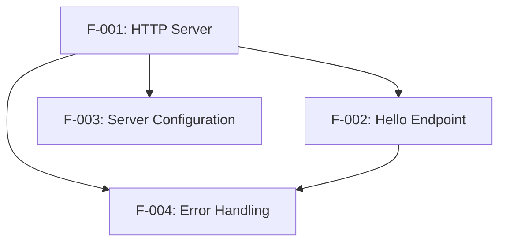
```mermaid
graph TD
    F001[F-001: HTTP Server] --> F002[F-002: Hello Endpoint]
    F001 --> F003[F-003: Server Configuration]
    F001 --> F004[F-004: Error Handling]
    F002 --> F004
```

### IMPLEMENTATION CONSIDERATIONS

**F-001: HTTP Server**

| Consideration | Description |
|---------------|-------------|
| Technical Constraints | Use only Node.js core modules |
| Performance Requirements | Low memory footprint, quick startup time |
| Scalability Considerations | Not applicable for tutorial project |
| Security Implications | No security measures required for tutorial |
| Maintenance Requirements | Simple code structure for easy understanding |

**F-002: Hello Endpoint**

| Consideration | Description |
|---------------|-------------|
| Technical Constraints | Implement with minimal complexity |
| Performance Requirements | Fast response time < 100ms |
| Scalability Considerations | Not applicable for tutorial project |
| Security Implications | None for this simple endpoint |
| Maintenance Requirements | Clear documentation of implementation |

**F-003: Server Configuration**

| Consideration | Description |
|---------------|-------------|
| Technical Constraints | Simple configuration mechanism |
| Performance Requirements | None |
| Scalability Considerations | Not applicable for tutorial project |
| Security Implications | None |
| Maintenance Requirements | Document configuration options |

**F-004: Error Handling**

| Consideration | Description |
|---------------|-------------|
| Technical Constraints | Basic error handling only |
| Performance Requirements | Minimal impact on normal operation |
| Scalability Considerations | Not applicable for tutorial project |
| Security Implications | No sensitive information in error messages |
| Maintenance Requirements | Clear error messages for troubleshooting |

### TRACEABILITY MATRIX

| Requirement ID | Feature ID | Priority | Status |
|----------------|-----------|----------|--------|
| F-001-RQ-001 | F-001 | Must-Have | Approved |
| F-001-RQ-002 | F-001 | Must-Have | Approved |
| F-001-RQ-003 | F-001 | Should-Have | Approved |
| F-002-RQ-001 | F-002 | Must-Have | Approved |
| F-002-RQ-002 | F-002 | Must-Have | Approved |
| F-002-RQ-003 | F-002 | Must-Have | Approved |
| F-003-RQ-001 | F-003 | Should-Have | Approved |
| F-003-RQ-002 | F-003 | Should-Have | Approved |
| F-004-RQ-001 | F-004 | Should-Have | Approved |
| F-004-RQ-002 | F-004 | Should-Have | Approved |

## 3. TECHNOLOGY STACK

### PROGRAMMING LANGUAGES

| Component | Language | Version | Justification |
|-----------|----------|---------|---------------|
| Server | JavaScript | ES6+ | Native language for Node.js runtime, ideal for lightweight HTTP servers and API development |
| Runtime | Node.js | 18.x LTS | Long-term support version offering stability and modern JavaScript features while maintaining a small footprint |

### FRAMEWORKS & LIBRARIES

| Component | Name | Version | Purpose | Justification |
|-----------|------|---------|---------|---------------|
| HTTP Server | Node.js Core HTTP | Built-in | Server implementation | Using Node.js core modules eliminates external dependencies, simplifies the implementation, and aligns with the minimal approach required for this tutorial project |

### OPEN SOURCE DEPENDENCIES

| Dependency | Version | Purpose | Source |
|------------|---------|---------|--------|
| None | N/A | N/A | N/A |

**Justification**: This project intentionally avoids external dependencies to demonstrate core Node.js functionality and maintain simplicity as an educational tool. All required functionality is implemented using Node.js built-in modules.

### DEVELOPMENT & DEPLOYMENT

| Tool | Version | Purpose | Justification |
|------|---------|---------|---------------|
| npm | 9.x+ | Package management | Standard package manager for Node.js projects, used for script execution |
| Git | 2.x+ | Version control | Industry standard for source code management |
| Visual Studio Code | Latest | Development environment | Popular editor with excellent JavaScript/Node.js support |

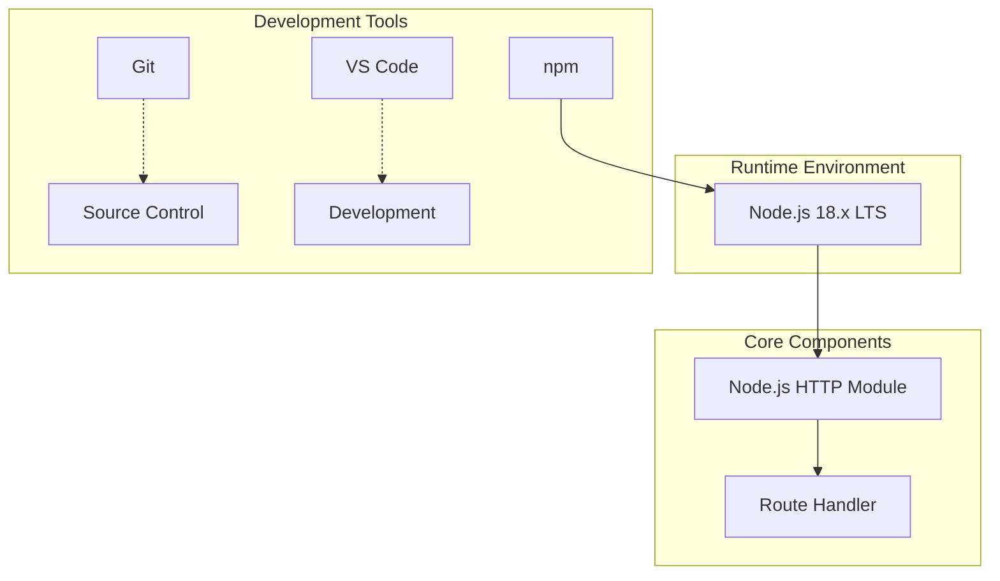
```mermaid
flowchart TD
    subgraph "Runtime Environment"
        Node["Node.js 18.x LTS"]
    end
    
    subgraph "Core Components"
        HTTP["Node.js HTTP Module"]
        Routes["Route Handler"]
    end
    
    subgraph "Development Tools"
        NPM["npm"]
        Git["Git"]
        VSCode["VS Code"]
        SourceControl["Source Control"]
        Development["Development"]
    end
    
    Node --> HTTP
    HTTP --> Routes
    NPM --> Node
    Git -.-> SourceControl
    VSCode -.-> Development
```

### TECHNOLOGY CONSTRAINTS

| Constraint | Description | Impact |
|------------|-------------|--------|
| Core Modules Only | Use only Node.js built-in modules | Ensures simplicity and educational value without external dependencies |
| Minimal Implementation | Keep code concise and focused | Enhances readability and learning experience |
| No Database | No data persistence required | Simplifies architecture and deployment |
| No Authentication | No security mechanisms required | Reduces complexity for tutorial purposes |

### TECHNOLOGY DECISIONS

| Decision | Alternatives Considered | Rationale |
|----------|-------------------------|-----------|
| Use Node.js core HTTP module | Express.js, Fastify, Koa | Core HTTP module provides the most direct educational value for understanding Node.js fundamentals without abstraction layers |
| No external dependencies | Using minimal frameworks | Demonstrates pure Node.js capabilities and simplifies setup for learners |
| JavaScript (ES6+) | TypeScript | Reduces complexity while maintaining modern language features; no compilation step required |

## 4. PROCESS FLOWCHART

### SYSTEM WORKFLOWS

#### Core Business Processes

##### HTTP Request Processing Workflow

| Process Step | Description |
|--------------|-------------|
| Request Receipt | Server receives HTTP request from client |
| Route Matching | System determines if the requested path matches '/hello' |
| Response Generation | System generates appropriate response based on route match |
| Response Delivery | Server sends HTTP response back to client |
| Error Handling | System handles any errors that occur during processing |

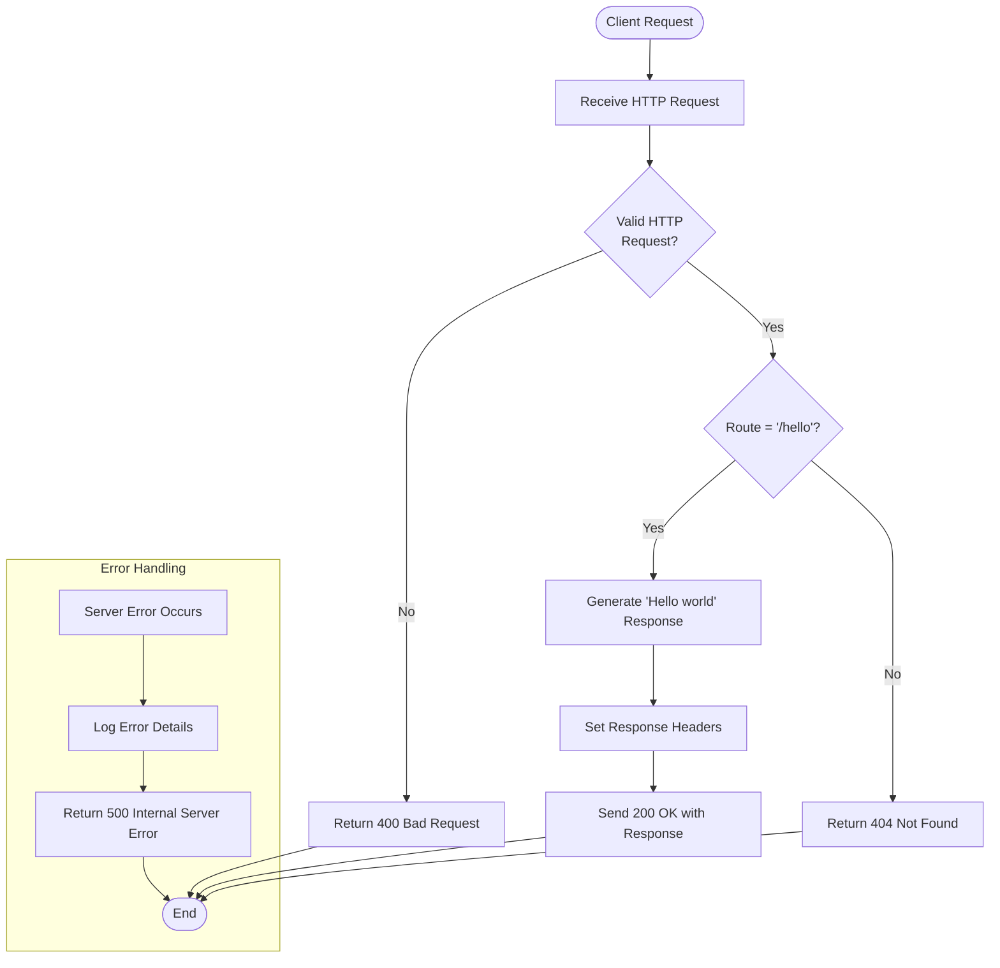
```mermaid
flowchart TD
    Start([Client Request]) --> ReceiveReq[Receive HTTP Request]
    ReceiveReq --> ValidReq{Valid HTTP\nRequest?}
    
    ValidReq -->|No| Error400[Return 400 Bad Request]
    Error400 --> End([End])
    
    ValidReq -->|Yes| RouteCheck{Route = '/hello'?}
    RouteCheck -->|Yes| HelloResponse["Generate 'Hello world' Response"]
    RouteCheck -->|No| Error404[Return 404 Not Found]
    
    HelloResponse --> SetHeaders[Set Response Headers]
    SetHeaders --> Send200[Send 200 OK with Response]
    Send200 --> End
    
    Error404 --> End
    
    subgraph "Error Handling"
        ServerError[Server Error Occurs] --> LogError[Log Error Details]
        LogError --> Return500[Return 500 Internal Server Error]
        Return500 --> End
    end
```

##### User Journey

| Step | Actor | Action | System Response |
|------|-------|--------|-----------------|
| 1 | Client | Sends HTTP GET request to '/hello' endpoint | Processes request |
| 2 | System | Validates request and matches route | N/A |
| 3 | System | Generates "Hello world" response | N/A |
| 4 | System | Returns response with 200 status code | N/A |
| 5 | Client | Receives "Hello world" response | N/A |

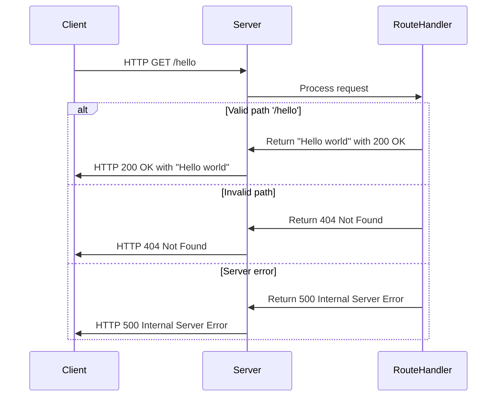
```mermaid
sequenceDiagram
    participant Client
    participant Server
    participant RouteHandler
    
    Client->>Server: HTTP GET /hello
    Server->>RouteHandler: Process request
    
    alt Valid path '/hello'
        RouteHandler->>Server: Return "Hello world" with 200 OK
        Server->>Client: HTTP 200 OK with "Hello world"
    else Invalid path
        RouteHandler->>Server: Return 404 Not Found
        Server->>Client: HTTP 404 Not Found
    else Server error
        RouteHandler->>Server: Return 500 Internal Server Error
        Server->>Client: HTTP 500 Internal Server Error
    end
```

#### Integration Workflows

##### Server Startup Sequence

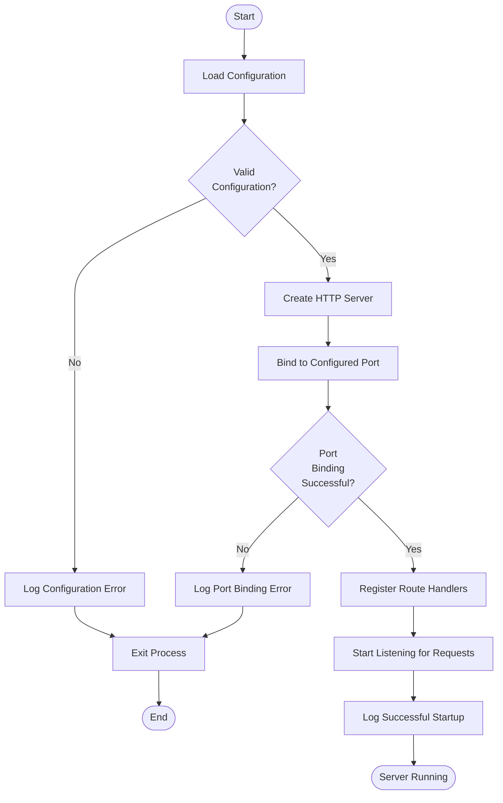
```mermaid
flowchart TD
    Start([Start]) --> LoadConfig[Load Configuration]
    LoadConfig --> ValidConfig{Valid\nConfiguration?}
    
    ValidConfig -->|No| LogConfigError[Log Configuration Error]
    LogConfigError --> ExitProcess[Exit Process]
    ExitProcess --> End([End])
    
    ValidConfig -->|Yes| CreateServer[Create HTTP Server]
    CreateServer --> BindPort[Bind to Configured Port]
    BindPort --> PortBound{Port\nBinding\nSuccessful?}
    
    PortBound -->|No| LogPortError[Log Port Binding Error]
    LogPortError --> ExitProcess
    
    PortBound -->|Yes| RegisterRoutes[Register Route Handlers]
    RegisterRoutes --> StartListening[Start Listening for Requests]
    StartListening --> LogStartup[Log Successful Startup]
    LogStartup --> ServerRunning([Server Running])
```

##### API Request Processing Flow

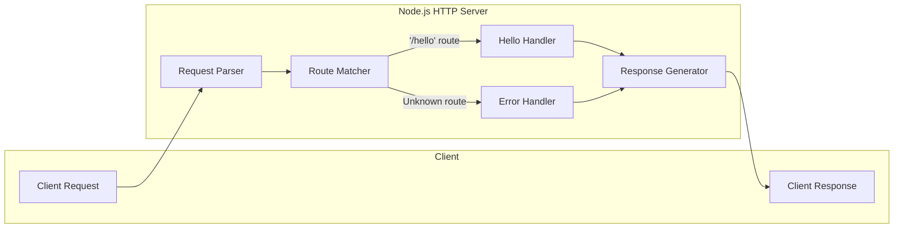
```mermaid
flowchart LR
    subgraph Client
        ClientReq[Client Request]
        ClientRes[Client Response]
    end
    
    subgraph "Node.js HTTP Server"
        ReqParser[Request Parser]
        Router[Route Matcher]
        HelloHandler[Hello Handler]
        ErrorHandler[Error Handler]
        ResGenerator[Response Generator]
    end
    
    ClientReq --> ReqParser
    ReqParser --> Router
    Router -->|'/hello' route| HelloHandler
    Router -->|Unknown route| ErrorHandler
    HelloHandler --> ResGenerator
    ErrorHandler --> ResGenerator
    ResGenerator --> ClientRes
```

### FLOWCHART REQUIREMENTS

#### Request Validation Flow

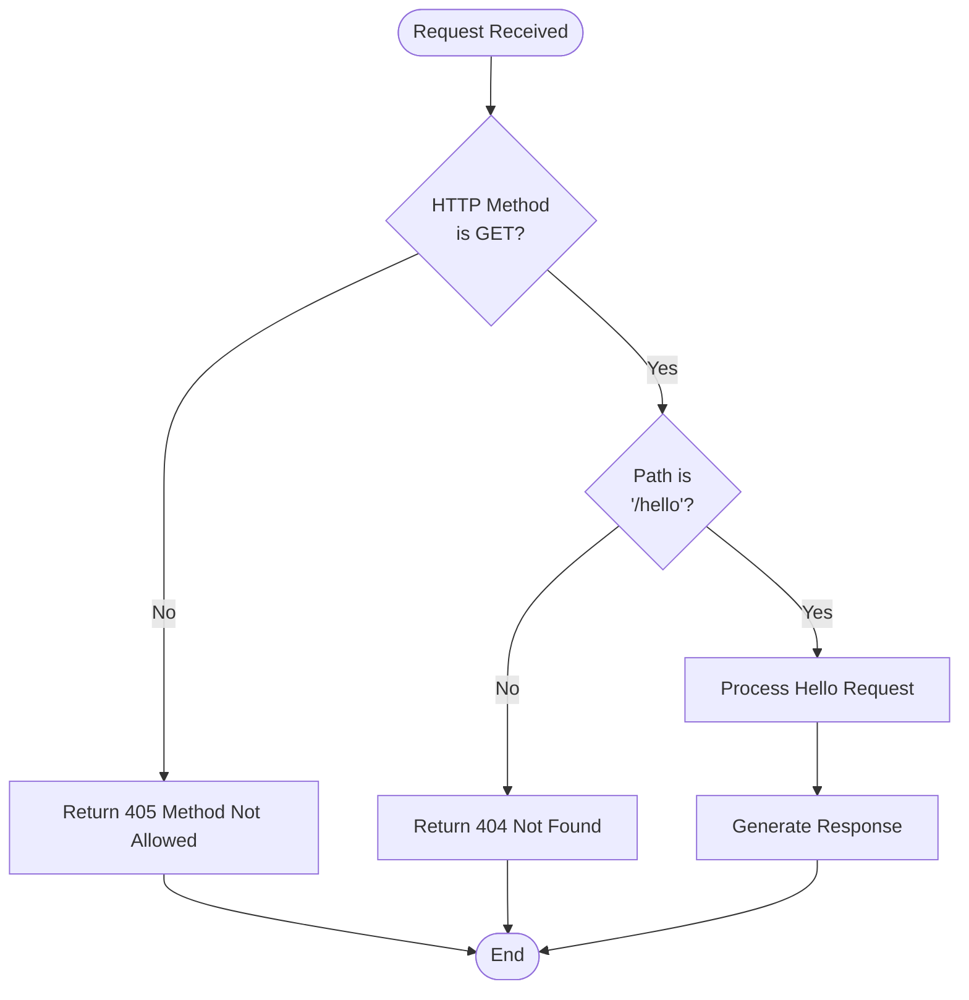
```mermaid
flowchart TD
    Start([Request Received]) --> ValidateMethod{HTTP Method\nis GET?}
    
    ValidateMethod -->|No| Method405[Return 405 Method Not Allowed]
    Method405 --> End([End])
    
    ValidateMethod -->|Yes| ValidatePath{Path is\n'/hello'?}
    
    ValidatePath -->|No| Path404[Return 404 Not Found]
    Path404 --> End
    
    ValidatePath -->|Yes| ProcessRequest[Process Hello Request]
    ProcessRequest --> GenerateResponse[Generate Response]
    GenerateResponse --> End
```

#### Error Handling Flow

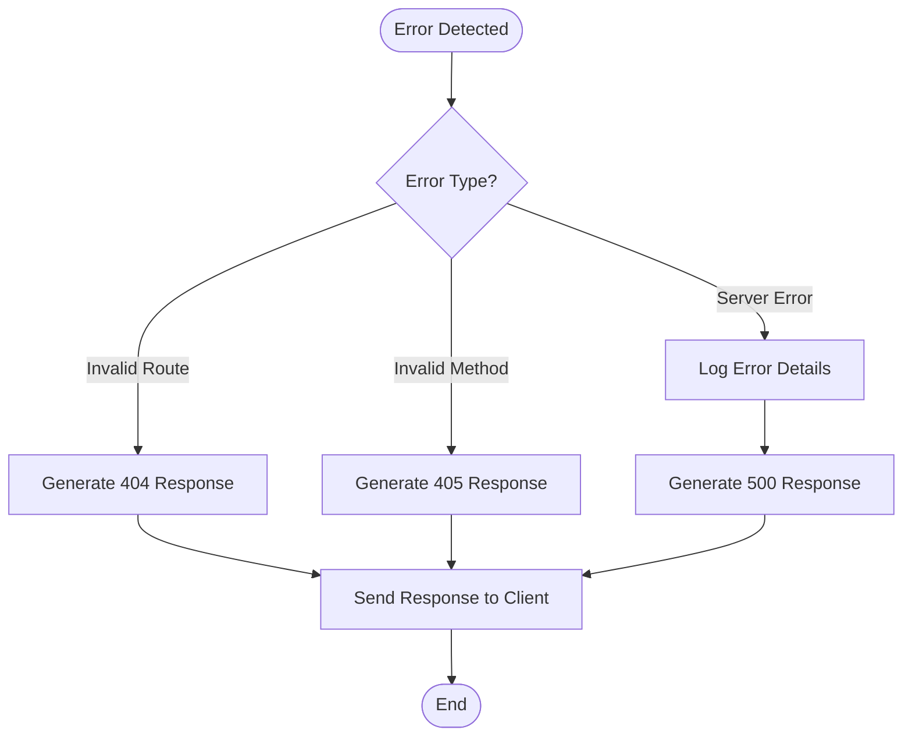
```mermaid
flowchart TD
    Start([Error Detected]) --> ErrorType{Error Type?}
    
    ErrorType -->|Invalid Route| Generate404[Generate 404 Response]
    ErrorType -->|Invalid Method| Generate405[Generate 405 Response]
    ErrorType -->|Server Error| LogError[Log Error Details]
    
    LogError --> Generate500[Generate 500 Response]
    
    Generate404 --> SendResponse[Send Response to Client]
    Generate405 --> SendResponse
    Generate500 --> SendResponse
    
    SendResponse --> End([End])
```

### TECHNICAL IMPLEMENTATION

#### State Management

| State | Description | Transition Trigger | Next State |
|-------|-------------|-------------------|------------|
| Server Initialization | Loading configuration and setting up server | Configuration loaded | Server Starting |
| Server Starting | Creating HTTP server instance | Server created | Server Binding |
| Server Binding | Binding to configured port | Port binding successful | Server Running |
| Server Running | Listening for incoming requests | Request received | Request Processing |
| Request Processing | Handling client request | Route matched | Response Generation |
| Response Generation | Creating response for client | Response prepared | Response Sending |
| Response Sending | Transmitting response to client | Response sent | Server Running |
| Error State | Handling unexpected conditions | Error detected | Error Recovery |
| Error Recovery | Generating error response | Recovery complete | Server Running |
| Server Shutdown | Gracefully closing connections | Shutdown complete | Server Stopped |

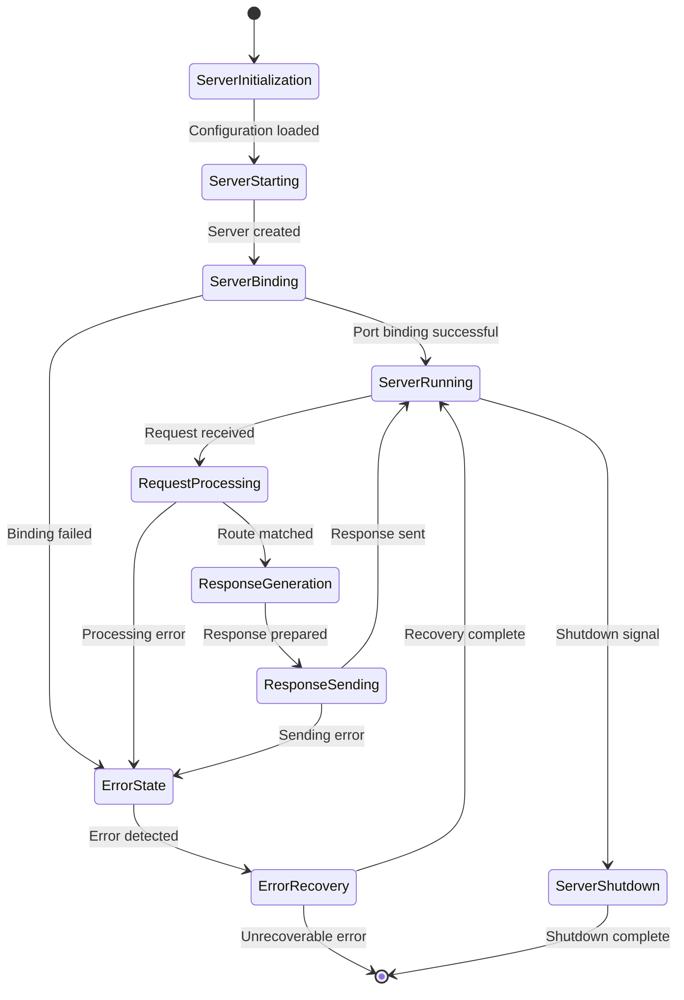
```mermaid
stateDiagram-v2
    [*] --> ServerInitialization
    ServerInitialization --> ServerStarting: Configuration loaded
    ServerStarting --> ServerBinding: Server created
    ServerBinding --> ServerRunning: Port binding successful
    ServerBinding --> ErrorState: Binding failed
    
    ServerRunning --> RequestProcessing: Request received
    RequestProcessing --> ResponseGeneration: Route matched
    RequestProcessing --> ErrorState: Processing error
    
    ResponseGeneration --> ResponseSending: Response prepared
    ResponseSending --> ServerRunning: Response sent
    ResponseSending --> ErrorState: Sending error
    
    ErrorState --> ErrorRecovery: Error detected
    ErrorRecovery --> ServerRunning: Recovery complete
    ErrorRecovery --> [*]: Unrecoverable error
    
    ServerRunning --> ServerShutdown: Shutdown signal
    ServerShutdown --> [*]: Shutdown complete
```

#### Error Handling Implementation

| Error Type | Detection Point | Handling Mechanism | Recovery Action |
|------------|-----------------|-------------------|-----------------|
| Invalid Route | Route matching | Return 404 Not Found | N/A - Expected behavior |
| Invalid Method | Request validation | Return 405 Method Not Allowed | N/A - Expected behavior |
| Server Startup Error | Server initialization | Log error and exit process | Manual intervention required |
| Runtime Exception | Request processing | Try/catch blocks, return 500 Internal Server Error | Continue serving other requests |
| Port Binding Error | Server startup | Log error and exit process | Manual intervention required |

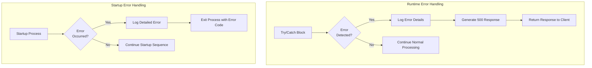
```mermaid
flowchart TD
    subgraph "Runtime Error Handling"
        TryCatch[Try/Catch Block] --> ErrorDetected{Error\nDetected?}
        ErrorDetected -->|Yes| LogError[Log Error Details]
        LogError --> Generate500[Generate 500 Response]
        Generate500 --> ReturnResponse[Return Response to Client]
        ErrorDetected -->|No| NormalProcessing[Continue Normal Processing]
    end
    
    subgraph "Startup Error Handling"
        StartupProcess[Startup Process] --> StartupError{Error\nOccurred?}
        StartupError -->|Yes| LogStartupError[Log Detailed Error]
        LogStartupError --> ExitProcess[Exit Process with Error Code]
        StartupError -->|No| ContinueStartup[Continue Startup Sequence]
    end
```

### REQUIRED DIAGRAMS

#### High-Level System Workflow

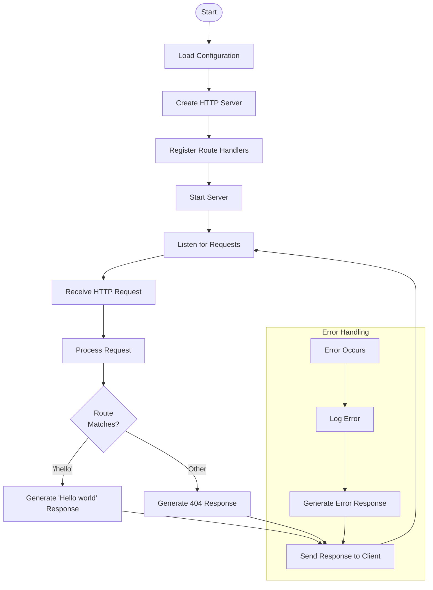
```mermaid
flowchart TD
    Start([Start]) --> LoadConfig[Load Configuration]
    LoadConfig --> CreateServer[Create HTTP Server]
    CreateServer --> RegisterRoutes[Register Route Handlers]
    RegisterRoutes --> StartServer[Start Server]
    
    StartServer --> ListenForRequests[Listen for Requests]
    
    ListenForRequests --> ReceiveRequest[Receive HTTP Request]
    ReceiveRequest --> ProcessRequest[Process Request]
    ProcessRequest --> RouteMatch{Route\nMatches?}
    
    RouteMatch -->|'/hello'| GenerateHello["Generate 'Hello world' Response"]
    RouteMatch -->|Other| Generate404[Generate 404 Response]
    
    GenerateHello --> SendResponse[Send Response to Client]
    Generate404 --> SendResponse
    
    SendResponse --> ListenForRequests
    
    subgraph "Error Handling"
        ErrorOccurs[Error Occurs] --> LogError[Log Error]
        LogError --> ErrorResponse[Generate Error Response]
        ErrorResponse --> SendResponse
    end
```

#### Detailed Process Flow for Hello Endpoint

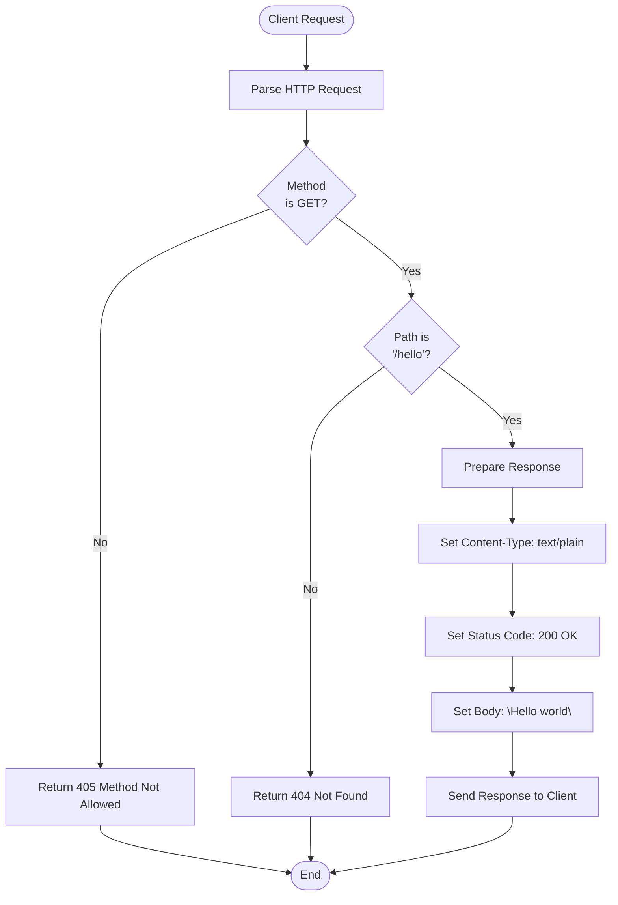
```mermaid
flowchart TD
    Start([Client Request]) --> ParseRequest[Parse HTTP Request]
    ParseRequest --> ValidateMethod{Method\nis GET?}
    
    ValidateMethod -->|No| Method405[Return 405 Method Not Allowed]
    ValidateMethod -->|Yes| ValidatePath{Path is\n'/hello'?}
    
    ValidatePath -->|No| Path404[Return 404 Not Found]
    ValidatePath -->|Yes| PrepareResponse[Prepare Response]
    
    PrepareResponse --> SetContentType[Set Content-Type: text/plain]
    SetContentType --> SetStatusCode[Set Status Code: 200 OK]
    SetStatusCode --> SetResponseBody["Set Body: \"Hello world\""]
    SetResponseBody --> SendResponse[Send Response to Client]
    
    Method405 --> End([End])
    Path404 --> End
    SendResponse --> End
```

#### Integration Sequence Diagram

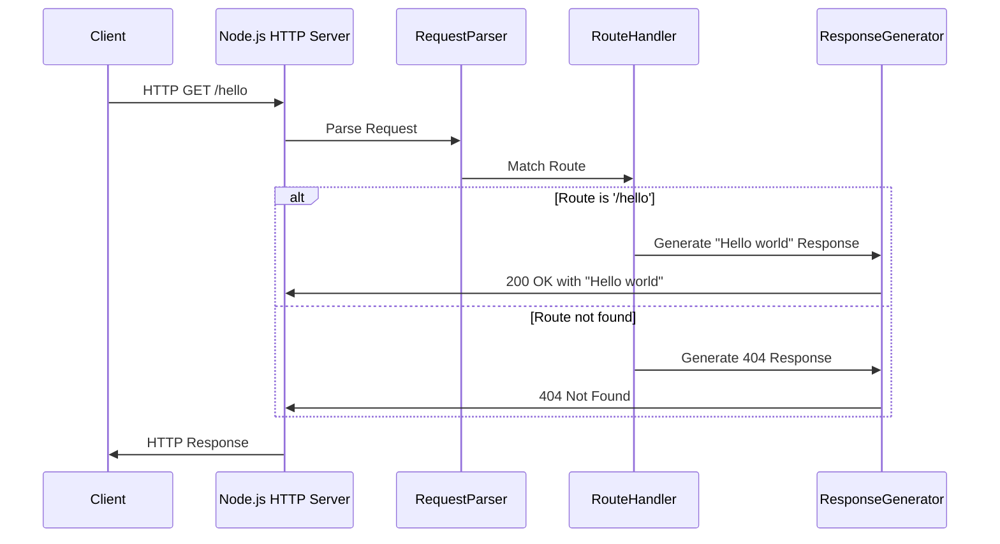
```mermaid
sequenceDiagram
    participant Client
    participant NodeHTTPServer as Node.js HTTP Server
    participant RequestParser
    participant RouteHandler
    participant ResponseGenerator
    
    Client->>NodeHTTPServer: HTTP GET /hello
    NodeHTTPServer->>RequestParser: Parse Request
    RequestParser->>RouteHandler: Match Route
    
    alt Route is '/hello'
        RouteHandler->>ResponseGenerator: Generate "Hello world" Response
        ResponseGenerator->>NodeHTTPServer: 200 OK with "Hello world"
    else Route not found
        RouteHandler->>ResponseGenerator: Generate 404 Response
        ResponseGenerator->>NodeHTTPServer: 404 Not Found
    end
    
    NodeHTTPServer->>Client: HTTP Response
```

#### Error Handling Flowchart

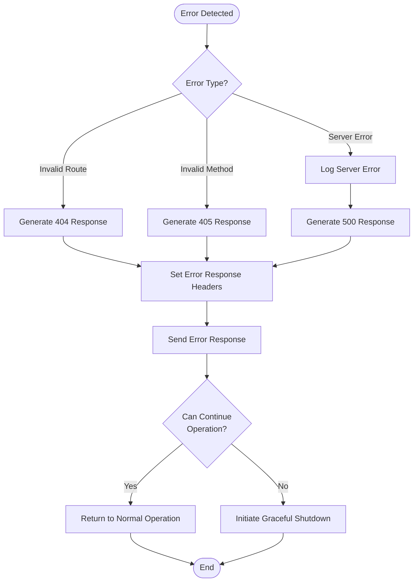
```mermaid
flowchart TD
    Start([Error Detected]) --> ErrorType{Error Type?}
    
    ErrorType -->|Invalid Route| Generate404[Generate 404 Response]
    ErrorType -->|Invalid Method| Generate405[Generate 405 Response]
    ErrorType -->|Server Error| LogServerError[Log Server Error]
    
    LogServerError --> Generate500[Generate 500 Response]
    
    Generate404 --> SetErrorHeaders[Set Error Response Headers]
    Generate405 --> SetErrorHeaders
    Generate500 --> SetErrorHeaders
    
    SetErrorHeaders --> SendErrorResponse[Send Error Response]
    SendErrorResponse --> ContinueOperation{Can Continue\nOperation?}
    
    ContinueOperation -->|Yes| ReturnToNormal[Return to Normal Operation]
    ContinueOperation -->|No| GracefulShutdown[Initiate Graceful Shutdown]
    
    ReturnToNormal --> End([End])
    GracefulShutdown --> End
```

## 5. SYSTEM ARCHITECTURE

### HIGH-LEVEL ARCHITECTURE

#### System Overview

The Node.js Hello World application follows a simple monolithic architecture pattern, appropriate for its minimal requirements. The system is built using a layered architecture with the following characteristics:

- **Architectural Style**: Lightweight monolithic HTTP server using Node.js core modules
- **Key Principles**:
  - Simplicity: Minimal implementation with no external dependencies
  - Separation of concerns: Clear distinction between server setup and request handling
  - Single responsibility: Each component has a focused purpose
- **System Boundaries**: Self-contained Node.js application with a single HTTP interface
- **Major Interfaces**: HTTP REST endpoint at `/hello` path

This architecture was chosen for its simplicity and educational value, making it ideal for demonstrating fundamental Node.js server concepts without the complexity of distributed systems or external dependencies.

#### Core Components Table

| Component Name | Primary Responsibility | Key Dependencies | Critical Considerations |
|----------------|------------------------|------------------|-------------------------|
| HTTP Server | Listen for incoming HTTP requests and route to appropriate handlers | Node.js core 'http' module | Port configuration, error handling during startup |
| Route Handler | Process incoming requests based on URL path and return appropriate responses | HTTP Server component | Path matching logic, HTTP method validation |
| Configuration Manager | Load and provide access to server configuration settings | Node.js core modules | Default values, environment variable handling |
| Error Handler | Capture and process errors, returning appropriate HTTP status codes | All components | Consistent error format, proper HTTP status codes |

#### Data Flow Description

The data flow in this simple application is straightforward:

1. The HTTP Server receives incoming client requests on the configured port
2. Requests are parsed to extract the HTTP method, URL path, headers, and body
3. The Route Handler evaluates the URL path to determine if it matches `/hello`
4. For matching routes, a "Hello world" response is generated with a 200 status code
5. For non-matching routes, a 404 Not Found response is generated
6. The HTTP Server sends the response back to the client

No data persistence is required, and all processing occurs in-memory. There are no data transformation points or data stores in this simple application.

#### External Integration Points

| System Name | Integration Type | Data Exchange Pattern | Protocol/Format |
|-------------|------------------|------------------------|-----------------|
| HTTP Clients | Inbound | Request-Response | HTTP/Plain Text |

### COMPONENT DETAILS

#### HTTP Server Component

- **Purpose**: Creates and manages the HTTP server that listens for incoming client requests
- **Responsibilities**:
  - Initialize the server on the configured port
  - Accept incoming HTTP connections
  - Parse HTTP requests
  - Route requests to appropriate handlers
  - Send responses back to clients
- **Technologies**: Node.js core 'http' module
- **Key Interfaces**:
  - `createServer()`: Creates the HTTP server instance
  - `listen()`: Binds the server to a port and starts listening
- **Scaling Considerations**: Not applicable for this simple tutorial application

#### Route Handler Component

- **Purpose**: Processes HTTP requests and generates appropriate responses
- **Responsibilities**:
  - Match request URL paths against defined routes
  - Validate HTTP methods
  - Generate responses for matching routes
  - Generate error responses for non-matching routes
- **Technologies**: JavaScript functions using Node.js request/response objects
- **Key Interfaces**:
  - Request handler function that receives (req, res) parameters
- **Scaling Considerations**: Not applicable for this simple tutorial application

#### Configuration Manager Component

- **Purpose**: Manages server configuration settings
- **Responsibilities**:
  - Load configuration from environment variables
  - Provide default values when configuration is not specified
  - Make configuration accessible to other components
- **Technologies**: Node.js core 'process' module for environment variables
- **Key Interfaces**:
  - Functions to retrieve configuration values with defaults
- **Scaling Considerations**: Not applicable for this simple tutorial application

#### Error Handler Component

- **Purpose**: Provides consistent error handling across the application
- **Responsibilities**:
  - Capture and log errors
  - Generate appropriate HTTP error responses
  - Ensure graceful handling of unexpected conditions
- **Technologies**: JavaScript try/catch blocks and HTTP status codes
- **Key Interfaces**:
  - Error handling functions that format error responses
- **Scaling Considerations**: Not applicable for this simple tutorial application

#### Component Interaction Diagram

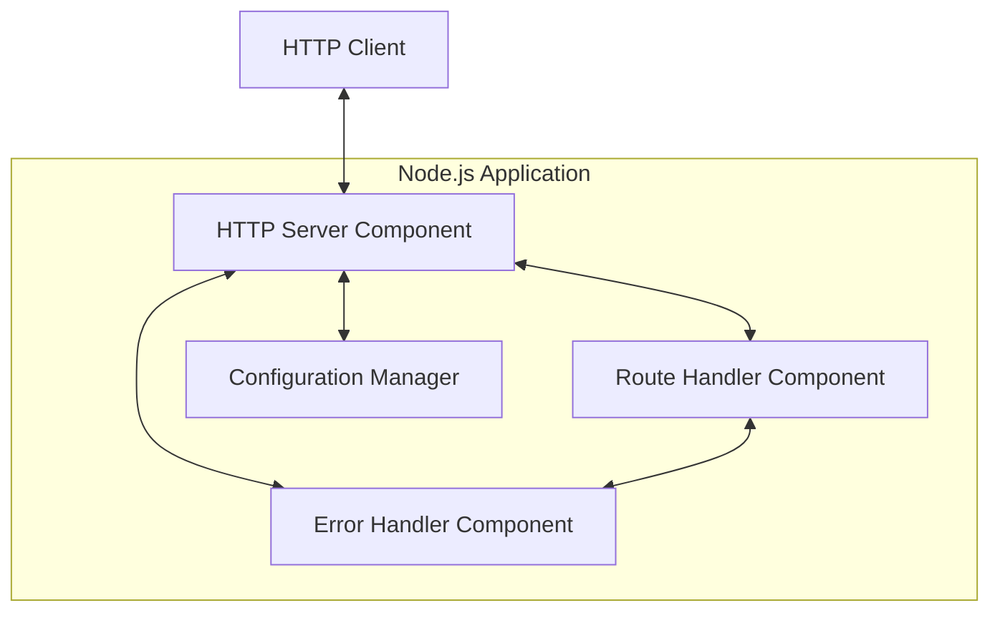
```mermaid
flowchart TD
    Client[HTTP Client] <--> HTTPServer[HTTP Server Component]
    HTTPServer <--> RouteHandler[Route Handler Component]
    HTTPServer <--> ErrorHandler[Error Handler Component]
    HTTPServer <--> ConfigManager[Configuration Manager]
    RouteHandler <--> ErrorHandler
    
    subgraph "Node.js Application"
        HTTPServer
        RouteHandler
        ErrorHandler
        ConfigManager
    end
```

#### Sequence Diagram for Hello Endpoint

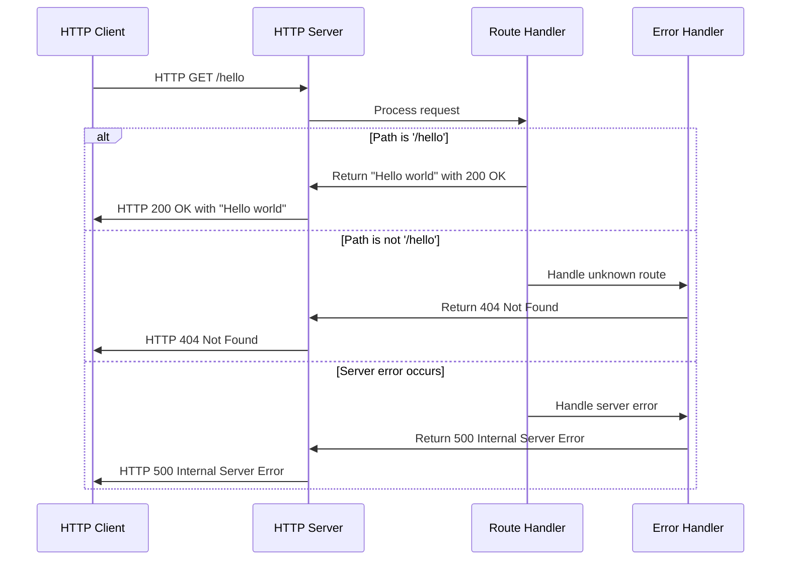
```mermaid
sequenceDiagram
    participant Client as HTTP Client
    participant Server as HTTP Server
    participant Router as Route Handler
    participant Error as Error Handler
    
    Client->>Server: HTTP GET /hello
    Server->>Router: Process request
    
    alt Path is '/hello'
        Router->>Server: Return "Hello world" with 200 OK
        Server->>Client: HTTP 200 OK with "Hello world"
    else Path is not '/hello'
        Router->>Error: Handle unknown route
        Error->>Server: Return 404 Not Found
        Server->>Client: HTTP 404 Not Found
    else Server error occurs
        Router->>Error: Handle server error
        Error->>Server: Return 500 Internal Server Error
        Server->>Client: HTTP 500 Internal Server Error
    end
```

### TECHNICAL DECISIONS

#### Architecture Style Decisions

| Decision | Rationale | Tradeoffs |
|----------|-----------|-----------|
| Monolithic Architecture | Simplicity and educational value; appropriate for minimal requirements | Limited scalability, but not a concern for this tutorial |
| Core Node.js Modules Only | Demonstrates fundamental Node.js capabilities without external dependencies | Fewer features than frameworks like Express, but better for learning core concepts |
| In-Memory Processing | No persistence requirements; simplifies implementation | Cannot store state between requests, but not needed for this application |

#### Communication Pattern Choices

| Pattern | Implementation | Justification |
|---------|----------------|---------------|
| Synchronous Request-Response | HTTP GET requests with immediate responses | Simple, standard pattern appropriate for REST endpoints |
| Plain Text Response Format | String response with text/plain content type | Minimalist approach aligned with tutorial objectives |
| HTTP Status Codes | Standard HTTP status codes (200, 404, 500) | Follows HTTP protocol standards for clear client communication |

#### Decision Tree for Architecture Style

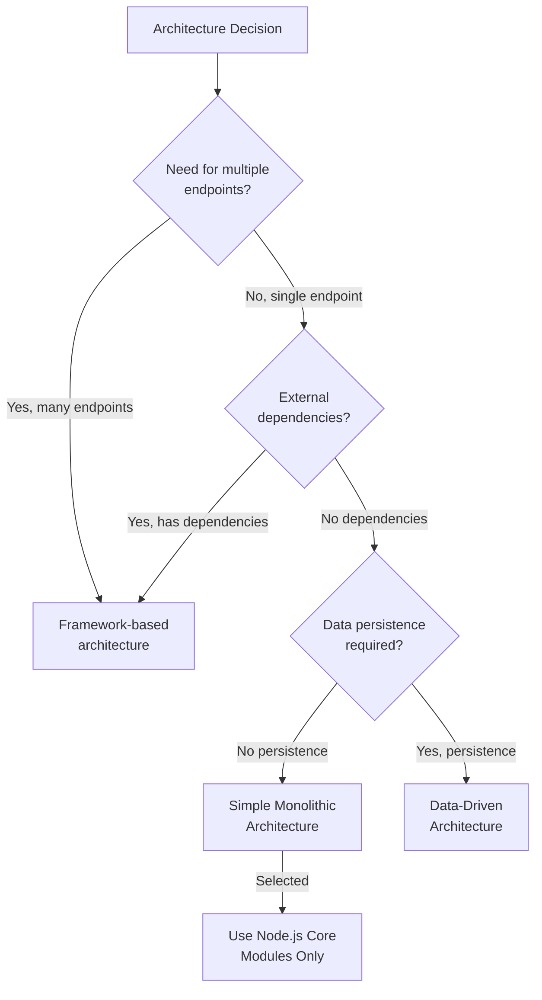
```mermaid
flowchart TD
    Start[Architecture Decision] --> Q1{Need for multiple\nendpoints?}
    Q1 -->|No, single endpoint| Q2{External\ndependencies?}
    Q1 -->|Yes, many endpoints| FrameworkBased[Framework-based\narchitecture]
    
    Q2 -->|No dependencies| Q3{Data persistence\nrequired?}
    Q2 -->|Yes, has dependencies| FrameworkBased
    
    Q3 -->|No persistence| SimpleMonolith[Simple Monolithic\nArchitecture]
    Q3 -->|Yes, persistence| DataDrivenArch[Data-Driven\nArchitecture]
    
    SimpleMonolith -->|Selected| CoreModules[Use Node.js Core\nModules Only]
```

### CROSS-CUTTING CONCERNS

#### Error Handling Patterns

The application implements a simple but comprehensive error handling strategy:

- **Route Not Found**: Returns HTTP 404 status code for undefined routes
- **Server Startup Errors**: Logs error and exits process with non-zero code
- **Runtime Exceptions**: Catches unexpected errors and returns HTTP 500 status code
- **Invalid HTTP Methods**: Returns HTTP 405 Method Not Allowed for non-GET requests

This approach ensures that all error conditions are handled gracefully and appropriate feedback is provided to clients.

#### Error Handling Flow

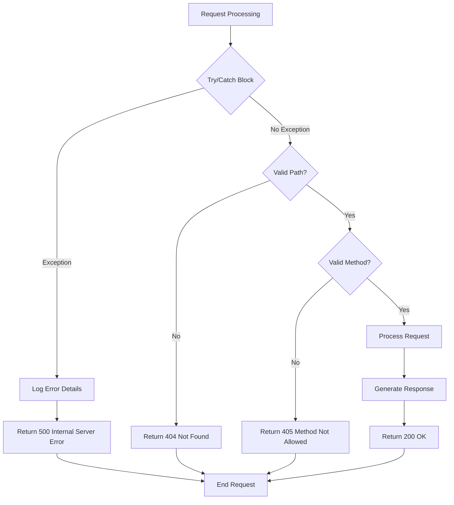
```mermaid
flowchart TD
    Start[Request Processing] --> TryCatch{Try/Catch Block}
    
    TryCatch -->|Exception| LogError[Log Error Details]
    LogError --> Return500[Return 500 Internal Server Error]
    
    TryCatch -->|No Exception| ValidPath{Valid Path?}
    ValidPath -->|Yes| ValidMethod{Valid Method?}
    ValidPath -->|No| Return404[Return 404 Not Found]
    
    ValidMethod -->|Yes| ProcessRequest[Process Request]
    ValidMethod -->|No| Return405[Return 405 Method Not Allowed]
    
    ProcessRequest --> GenerateResponse[Generate Response]
    GenerateResponse --> Return200[Return 200 OK]
    
    Return500 --> End[End Request]
    Return404 --> End
    Return405 --> End
    Return200 --> End
```

#### Logging Strategy

For this simple application, a minimal logging strategy is implemented:

- Server startup information (port, time)
- Error conditions with relevant details
- No request logging for this tutorial application

This approach provides essential operational information without unnecessary complexity.

#### Performance Requirements

| Requirement | Target | Implementation Approach |
|-------------|--------|-------------------------|
| Response Time | < 100ms | Minimal processing, no external dependencies |
| Startup Time | < 1 second | Lightweight implementation with no initialization overhead |
| Resource Usage | Minimal memory footprint | Core modules only, no unnecessary components |

## 6. SYSTEM COMPONENTS DESIGN

### SERVER COMPONENT

#### Component Overview

| Aspect | Description |
|--------|-------------|
| Purpose | Core HTTP server that listens for incoming requests and manages the request-response lifecycle |
| Responsibilities | Initialize server, bind to port, handle connections, route requests, send responses |
| Dependencies | Node.js core 'http' module |
| Interfaces | HTTP protocol on configured TCP port |

#### Implementation Details

| Element | Specification |
|---------|---------------|
| Module Structure | Single module exporting server creation and initialization functions |
| Configuration Parameters | Port number (default: 3000) |
| Error Handling | Try/catch for server creation, event listeners for runtime errors |
| Lifecycle Management | Proper startup sequence, graceful shutdown handling |

#### Component Diagram

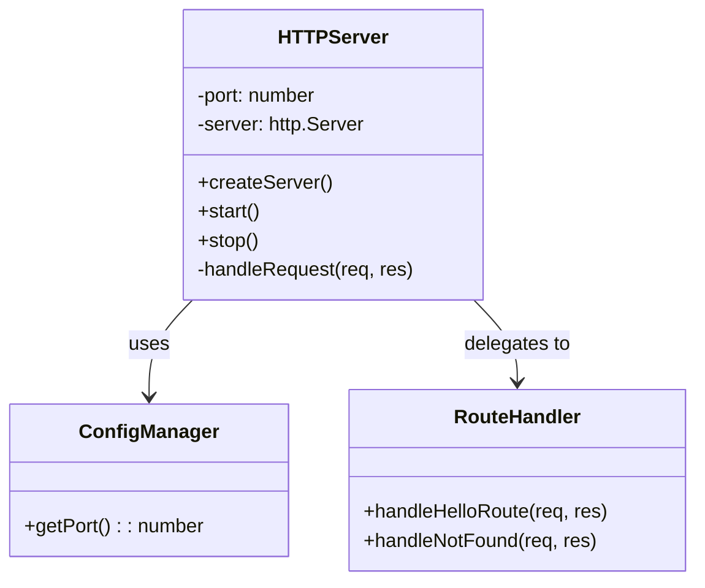
```mermaid
classDiagram
    class HTTPServer {
        -port: number
        -server: http.Server
        +createServer()
        +start()
        +stop()
        -handleRequest(req, res)
    }
    
    class ConfigManager {
        +getPort(): number
    }
    
    class RouteHandler {
        +handleHelloRoute(req, res)
        +handleNotFound(req, res)
    }
    
    HTTPServer --> ConfigManager: uses
    HTTPServer --> RouteHandler: delegates to
```

### ROUTE HANDLER COMPONENT

#### Component Overview

| Aspect | Description |
|--------|-------------|
| Purpose | Process HTTP requests and generate appropriate responses based on URL path |
| Responsibilities | Match routes, validate HTTP methods, generate responses |
| Dependencies | None (uses Node.js request/response objects) |
| Interfaces | Function accepting request and response objects |

#### Implementation Details

| Element | Specification |
|---------|---------------|
| Module Structure | Module exporting route handler functions |
| Route Definitions | Single route for '/hello' path |
| HTTP Methods | Support for GET method only |
| Response Format | Plain text with appropriate content-type header |

#### Route Table

| Route | HTTP Method | Handler Function | Response |
|-------|------------|------------------|----------|
| /hello | GET | handleHelloRoute | 200 OK with "Hello world" text |
| * (any other) | * (any) | handleNotFound | 404 Not Found |
| /hello | non-GET | handleMethodNotAllowed | 405 Method Not Allowed |

#### Request Processing Flow

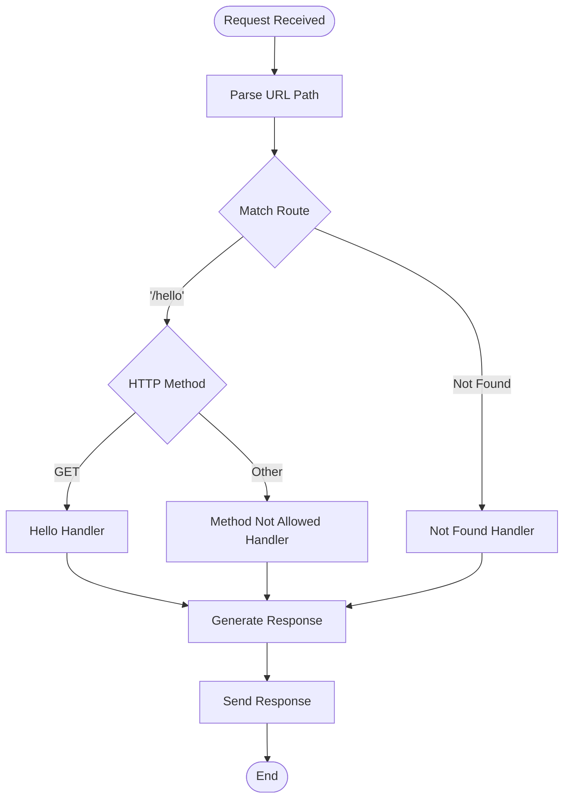
```mermaid
flowchart TD
    Start([Request Received]) --> ParseURL[Parse URL Path]
    ParseURL --> MatchRoute{Match Route}
    
    MatchRoute -->|'/hello'| CheckMethod{HTTP Method}
    MatchRoute -->|Not Found| NotFoundHandler[Not Found Handler]
    
    CheckMethod -->|GET| HelloHandler[Hello Handler]
    CheckMethod -->|Other| MethodNotAllowedHandler[Method Not Allowed Handler]
    
    HelloHandler --> GenerateResponse[Generate Response]
    NotFoundHandler --> GenerateResponse
    MethodNotAllowedHandler --> GenerateResponse
    
    GenerateResponse --> SendResponse[Send Response]
    SendResponse --> End([End])
```

### ERROR HANDLER COMPONENT

#### Component Overview

| Aspect | Description |
|--------|-------------|
| Purpose | Provide consistent error handling across the application |
| Responsibilities | Format error responses, set appropriate status codes, log errors |
| Dependencies | None |
| Interfaces | Functions for different error types |

#### Implementation Details

| Element | Specification |
|---------|---------------|
| Module Structure | Module exporting error handling functions |
| Error Types | Not Found (404), Method Not Allowed (405), Server Error (500) |
| Response Format | Plain text error messages with appropriate status codes |
| Logging | Console output for errors with relevant details |

#### Error Response Table

| Error Type | HTTP Status | Response Body | Headers |
|------------|-------------|--------------|---------|
| Not Found | 404 | "Not Found" | Content-Type: text/plain |
| Method Not Allowed | 405 | "Method Not Allowed" | Content-Type: text/plain, Allow: GET |
| Server Error | 500 | "Internal Server Error" | Content-Type: text/plain |

#### Error Handling Flow

```mermaid
flowchart TD
    Start([Error Detected]) --> ErrorType{Error Type}
    
    ErrorType -->|Not Found| SetStatus404[Set Status 404]
    ErrorType -->|Method Not Allowed| SetStatus405[Set Status 405]
    ErrorType -->|Server Error| LogError[Log Error Details]
    
    LogError --> SetStatus500[Set Status 500]
    
    SetStatus404 --> SetHeaders[Set Response Headers]
    SetStatus405 --> SetAllowHeader[Set Allow Header]
    SetAllowHeader --> SetHeaders
    SetStatus500 --> SetHeaders
    
    SetHeaders --> WriteResponse[Write Response Body]
    WriteResponse --> EndResponse[End Response]
    EndResponse --> End([End])
```

### CONFIGURATION COMPONENT

#### Component Overview

| Aspect | Description |
|--------|-------------|
| Purpose | Manage server configuration settings |
| Responsibilities | Load configuration from environment, provide defaults |
| Dependencies | Node.js 'process' module for environment variables |
| Interfaces | Functions to retrieve configuration values |

#### Implementation Details

| Element | Specification |
|---------|---------------|
| Module Structure | Module exporting configuration getter functions |
| Configuration Sources | Environment variables, with defaults when not specified |
| Default Values | Port: 3000 |
| Validation | Basic validation for port number (numeric, within valid range) |

#### Configuration Parameters

| Parameter | Environment Variable | Default | Validation |
|-----------|----------------------|---------|-----------|
| Port | PORT | 3000 | Number between 1024-65535 |

#### Configuration Loading Flow

```mermaid
flowchart TD
    Start([Load Configuration]) --> CheckEnvVar{Environment\nVariable Set?}
    
    CheckEnvVar -->|Yes| ParseValue[Parse Value]
    CheckEnvVar -->|No| UseDefault[Use Default Value]
    
    ParseValue --> ValidateValue{Valid Value?}
    ValidateValue -->|Yes| ReturnValue[Return Value]
    ValidateValue -->|No| LogWarning[Log Warning]
    LogWarning --> UseDefault
    
    UseDefault --> ReturnValue
    ReturnValue --> End([End])
```

### COMPONENT INTERACTIONS

#### Request Processing Sequence

```mermaid
sequenceDiagram
    participant Client
    participant Server as HTTP Server
    participant Router as Route Handler
    participant ErrorHandler
    
    Client->>Server: HTTP Request
    Server->>Router: Forward Request
    
    alt Valid Route (/hello)
        Router->>Router: Validate Method
        
        alt Valid Method (GET)
            Router->>Client: Return "Hello world" (200 OK)
        else Invalid Method
            Router->>ErrorHandler: Method Not Allowed
            ErrorHandler->>Client: Return 405 Response
        end
    else Invalid Route
        Router->>ErrorHandler: Not Found
        ErrorHandler->>Client: Return 404 Response
    end
    
    note over Server: Error can occur at any point
    
    alt Server Error Occurs
        Server->>ErrorHandler: Server Error
        ErrorHandler->>Client: Return 500 Response
    end
```

#### Component Dependencies

```mermaid
flowchart TD
    Client[HTTP Client] --> Server[HTTP Server]
    
    subgraph "Node.js Application"
        Server --> Router[Route Handler]
        Server --> ErrorHandler[Error Handler]
        Server --> Config[Configuration]
        
        Router --> ErrorHandler
    end
    
    Server --> Client
```

### INTERFACE SPECIFICATIONS

#### HTTP Server Interface

| Method | Description | Parameters | Return Value |
|--------|-------------|------------|-------------|
| createServer | Creates HTTP server instance | None | Server instance |
| start | Starts server on configured port | None | Promise resolving on successful start |
| stop | Gracefully stops the server | None | Promise resolving on successful stop |

#### Route Handler Interface

| Method | Description | Parameters | Return Value |
|--------|-------------|------------|-------------|
| handleRequest | Main request router | req: HTTP request, res: HTTP response | void |
| handleHelloRoute | Handles '/hello' route | req: HTTP request, res: HTTP response | void |
| handleNotFound | Handles unknown routes | req: HTTP request, res: HTTP response | void |
| handleMethodNotAllowed | Handles invalid HTTP methods | req: HTTP request, res: HTTP response | void |

#### Error Handler Interface

| Method | Description | Parameters | Return Value |
|--------|-------------|------------|-------------|
| handleNotFound | Generates 404 response | res: HTTP response | void |
| handleMethodNotAllowed | Generates 405 response | res: HTTP response | void |
| handleServerError | Generates 500 response | res: HTTP response, error: Error object | void |

#### Configuration Interface

| Method | Description | Parameters | Return Value |
|--------|-------------|------------|-------------|
| getPort | Returns configured port | None | number (port) |

### COMPONENT DESIGN DECISIONS

| Decision | Alternatives | Rationale |
|----------|--------------|-----------|
| Separate route handler from server | Combined implementation | Separation of concerns, better testability |
| Function-based components | Class-based components | Simplicity, functional approach fits Node.js patterns |
| Explicit error handling component | Inline error handling | Consistency, reusability of error handling logic |
| Environment-based configuration | Configuration files | Simplicity, follows 12-factor app principles |
| Plain text responses | JSON responses | Minimalism, appropriate for simple tutorial |

### 6.1 CORE SERVICES ARCHITECTURE

Core Services Architecture is not applicable for this system. This Node.js Hello World application is intentionally designed as a simple, monolithic application with minimal complexity to serve educational purposes. The reasons for not implementing a microservices or distributed architecture include:

1. **Minimal Functional Requirements**: The application only needs to serve a single endpoint (`/hello`) with a static response, which doesn't warrant the complexity of a distributed architecture.

2. **Educational Purpose**: As a tutorial project, the focus is on demonstrating fundamental Node.js HTTP server concepts without introducing advanced architectural patterns that would obscure the basic learning objectives.

3. **No Scalability Requirements**: The application doesn't have performance or throughput requirements that would necessitate distributed processing or horizontal scaling.

4. **Simplicity as a Design Goal**: Maintaining a simple, self-contained codebase aligns with the project's goal of being easily understandable for learning purposes.

#### Alternative Architecture Considerations

While a microservices architecture is not implemented, it's worth noting the architectural choices made for this simple application:

| Architectural Aspect | Implementation Approach | Justification |
|----------------------|-------------------------|---------------|
| Application Structure | Single-module monolith | Appropriate for the minimal requirements and educational focus |
| Scalability | Vertical scaling only (if needed) | Sufficient for expected load; horizontal scaling would add unnecessary complexity |
| Resilience | Basic error handling | Adequate for demonstration purposes without overengineering |
| Deployment | Standalone Node.js process | Simplifies setup and execution for learning purposes |

#### Simplified System Architecture

```mermaid
flowchart TD
    Client[HTTP Client] <--> Server[Node.js HTTP Server]
    
    subgraph "Node.js Application"
        Server --> RequestHandler[Request Handler]
        RequestHandler --> HelloEndpoint["/hello Endpoint"]
        RequestHandler --> ErrorHandler[Error Handler]
    end
```

This simplified architecture provides all the necessary functionality while maintaining clarity and ease of understanding for educational purposes. If requirements were to expand significantly (multiple complex endpoints, high traffic volumes, or integration with external systems), a more sophisticated architecture with distinct service components could be considered in the future.

### 6.2 DATABASE DESIGN

Database Design is not applicable to this system. The Node.js Hello World application with a single `/hello` endpoint that returns "Hello world" does not require any persistent data storage for the following reasons:

1. **No Data Persistence Requirements**: The application serves a static response ("Hello world") that doesn't change based on stored data or user interactions.

2. **Stateless Operation**: The HTTP server operates in a completely stateless manner, with each request being processed independently without needing to reference previous requests or stored state.

3. **No User Data**: The application doesn't collect, process, or store any user information that would require database storage.

4. **No Configuration Storage**: All configuration (such as the port number) is handled through environment variables or defaults in the code, eliminating the need for configuration storage in a database.

5. **No Dynamic Content**: The response content is static and hardcoded, requiring no retrieval from a data store.

#### Alternative Approaches Considered

While a database is not needed for the current requirements, here are approaches that could be considered if the application were to evolve:

| Scenario | Potential Database Approach | Justification |
|----------|----------------------------|---------------|
| Request Logging | Simple file-based storage or lightweight DB like SQLite | If request logging became a requirement, a simple storage solution could be added |
| User Customization | Document database like MongoDB | If users could customize their "Hello" messages, a document store could maintain these preferences |
| Rate Limiting | In-memory store like Redis | If rate limiting were needed, a fast in-memory database could track request counts |
| Analytics | Time-series database | If tracking usage patterns became important, a specialized database could store metrics |

#### Data Flow Without Database

```mermaid
flowchart LR
    Client[HTTP Client] -->|HTTP Request| Server[Node.js Server]
    Server -->|Static Response| Client
    
    subgraph "Node.js Application"
        Server -->|Request| Handler[Request Handler]
        Handler -->|"Hello world"| Server
    end
```

This diagram illustrates how the application functions without any database interaction. The request handler simply returns a static string response without needing to query or store any data.

If future requirements necessitate data persistence, the technical specifications would need to be updated to include appropriate database design considerations including schema design, data management strategies, compliance considerations, and performance optimization approaches.

### 6.3 INTEGRATION ARCHITECTURE

Integration Architecture is not applicable for this system. The Node.js Hello World application with a single `/hello` endpoint is intentionally designed as a standalone, self-contained system that does not integrate with any external systems or services for the following reasons:

1. **Minimal Functional Requirements**: The application only needs to serve a single endpoint (`/hello`) with a static response, which doesn't require integration with external systems.

2. **Educational Purpose**: As a tutorial project, the focus is on demonstrating fundamental Node.js HTTP server concepts without introducing the complexity of external integrations.

3. **No External Dependencies**: The application uses only Node.js core modules and doesn't rely on external APIs, databases, or services to fulfill its requirements.

4. **Simplicity as a Design Goal**: Maintaining a simple, self-contained codebase aligns with the project's goal of being easily understandable for learning purposes.

#### API Considerations

While the system doesn't integrate with external systems, it does expose a minimal API that clients can consume:

| Aspect | Implementation | Justification |
|--------|---------------|---------------|
| Protocol | HTTP/1.1 | Industry standard protocol for web services |
| Endpoint | GET /hello | Simple, descriptive endpoint name |
| Response Format | Plain text | Simplest format for the "Hello world" response |
| Authentication | None | Not required for this public endpoint |

#### Client Integration Pattern

```mermaid
sequenceDiagram
    participant Client as HTTP Client
    participant Server as Node.js Server
    
    Client->>Server: HTTP GET /hello
    Server->>Client: 200 OK "Hello world"
    
    alt Invalid Path
        Client->>Server: HTTP GET /invalid-path
        Server->>Client: 404 Not Found
    end
```

#### System Boundary Diagram

```mermaid
flowchart LR
    subgraph "Client Environment"
        WebBrowser[Web Browser]
        MobileApp[Mobile App]
        APIClient[API Client]
    end
    
    subgraph "Node.js Hello World Application"
        HTTPServer[HTTP Server]
        RouteHandler[Route Handler]
        ErrorHandler[Error Handler]
    end
    
    WebBrowser -->|HTTP Request| HTTPServer
    MobileApp -->|HTTP Request| HTTPServer
    APIClient -->|HTTP Request| HTTPServer
    
    HTTPServer -->|Response| WebBrowser
    HTTPServer -->|Response| MobileApp
    HTTPServer -->|Response| APIClient
```

If future requirements necessitate integration with external systems, the technical specifications would need to be updated to include appropriate integration architecture considerations including API design, message processing patterns, and external system interfaces.

### 6.4 SECURITY ARCHITECTURE

Detailed Security Architecture is not applicable for this system. The Node.js Hello World application with a single `/hello` endpoint that returns "Hello world" is intentionally designed as a minimal demonstration application with no authentication, authorization, or sensitive data handling requirements for the following reasons:

1. **Public Access Endpoint**: The `/hello` endpoint is designed to be publicly accessible without any access restrictions.

2. **No Sensitive Data**: The application doesn't process, store, or transmit any sensitive or personal data.

3. **No User Authentication**: The application doesn't require user identification or authentication to access its functionality.

4. **Educational Purpose**: As a tutorial project, the focus is on demonstrating fundamental Node.js HTTP server concepts without introducing security complexities that would obscure the basic learning objectives.

#### Standard Security Practices

While a comprehensive security architecture isn't required, the following standard security practices will be implemented:

| Security Practice | Implementation Approach | Justification |
|-------------------|-------------------------|---------------|
| Input Validation | Validate HTTP method and URL path | Prevents unexpected behavior from malformed requests |
| Error Handling | Return appropriate status codes without exposing system details | Prevents information leakage through error messages |
| HTTP Headers | Set appropriate security headers | Follows web security best practices |
| Resource Limitations | Implement basic request size limits | Prevents simple resource exhaustion attacks |

#### Security Headers Implementation

| Header | Value | Purpose |
|--------|-------|---------|
| X-Content-Type-Options | nosniff | Prevents MIME type sniffing |
| X-Frame-Options | DENY | Prevents clickjacking attacks |
| Content-Security-Policy | default-src 'none' | Restricts resource loading |
| Cache-Control | no-store | Prevents response caching |

#### Basic Security Flow

```mermaid
flowchart TD
    Start([Request Received]) --> ValidateRequest[Validate Request]
    ValidateRequest --> CheckMethod{Valid HTTP\nMethod?}
    
    CheckMethod -->|No| Return405[Return 405 Method Not Allowed]
    CheckMethod -->|Yes| CheckPath{Valid Path?}
    
    CheckPath -->|No| Return404[Return 404 Not Found]
    CheckPath -->|Yes| SizeCheck{Request Size\nWithin Limits?}
    
    SizeCheck -->|No| Return413[Return 413 Payload Too Large]
    SizeCheck -->|Yes| ProcessRequest[Process Request]
    
    ProcessRequest --> SetSecHeaders[Set Security Headers]
    SetSecHeaders --> SendResponse[Send Response]
    
    Return405 --> SetSecHeaders
    Return404 --> SetSecHeaders
    Return413 --> SetSecHeaders
    
    SendResponse --> End([End])
```

#### Security Zones

```mermaid
flowchart LR
    subgraph "Public Internet"
        Client[HTTP Client]
    end
    
    subgraph "Application Environment"
        NodeApp[Node.js Application]
        subgraph "HTTP Server"
            RequestValidation[Request Validation]
            ResponseHeaders[Security Headers]
        end
    end
    
    Client -->|HTTP Request| RequestValidation
    ResponseHeaders -->|HTTP Response| Client
```

#### Future Security Considerations

If the application were to evolve beyond its current minimal requirements, the following security enhancements should be considered:

| Security Enhancement | When to Implement |
|----------------------|-------------------|
| Rate Limiting | If the application becomes publicly hosted or experiences high traffic |
| HTTPS/TLS | If deployed to production or if any sensitive information is added |
| Logging & Monitoring | If operational visibility becomes important |
| Dependency Scanning | If external dependencies are added to the project |

This approach ensures that the application maintains appropriate security controls proportional to its risk profile while preserving its educational value and simplicity.

### 6.5 MONITORING AND OBSERVABILITY

Detailed Monitoring Architecture is not applicable for this system. The Node.js Hello World application with a single `/hello` endpoint is intentionally designed as a minimal demonstration application that doesn't require comprehensive monitoring and observability infrastructure for the following reasons:

1. **Minimal Complexity**: The application consists of a single endpoint with static response behavior, limiting the need for extensive monitoring.

2. **Educational Purpose**: As a tutorial project, the focus is on demonstrating fundamental Node.js HTTP server concepts without introducing monitoring complexities.

3. **No Production Requirements**: The application is not designed for production deployment with high availability or performance requirements.

4. **No Business-Critical Functions**: The application doesn't perform business-critical operations that would require detailed performance tracking or alerting.

#### Basic Monitoring Practices

While comprehensive monitoring isn't required, the following basic monitoring practices will be implemented:

| Monitoring Practice | Implementation Approach | Justification |
|---------------------|-------------------------|---------------|
| Basic Health Logging | Log server start/stop events | Provides visibility into application lifecycle |
| Request Logging | Log incoming requests and response status | Enables basic troubleshooting and usage tracking |
| Error Logging | Capture and log all errors with stack traces | Facilitates debugging when issues occur |
| Process Monitoring | Monitor Node.js process for crashes | Ensures awareness of application failures |

#### Health Check Implementation

A simple health check endpoint will be added to facilitate basic monitoring:

| Endpoint | Method | Response | Purpose |
|----------|--------|----------|---------|
| /health | GET | 200 OK with uptime | Provides basic application health status |

#### Basic Metrics Collection

The application will track a minimal set of metrics for educational purposes:

| Metric | Description | Collection Method |
|--------|-------------|------------------|
| Request Count | Total number of requests received | In-memory counter |
| Response Time | Time to process requests | Timing in request handler |
| Error Count | Number of errors encountered | In-memory counter |
| Uptime | Time since server start | Calculate from start timestamp |

#### Simplified Monitoring Flow

```mermaid
flowchart TD
    Start([Server Start]) --> InitCounters[Initialize Counters]
    InitCounters --> LogStartup[Log Startup Information]
    LogStartup --> ListenRequests[Listen for Requests]
    
    ListenRequests --> ReceiveRequest[Receive Request]
    ReceiveRequest --> StartTimer[Start Request Timer]
    StartTimer --> ProcessRequest[Process Request]
    
    ProcessRequest --> EndTimer[End Request Timer]
    EndTimer --> LogRequest[Log Request Details]
    LogRequest --> UpdateMetrics[Update Metrics]
    UpdateMetrics --> ListenRequests
    
    ProcessRequest -->|Error| LogError[Log Error Details]
    LogError --> IncrementErrorCount[Increment Error Count]
    IncrementErrorCount --> EndTimer
```

#### Health Check Response

```mermaid
flowchart LR
    Client[Monitoring Client] -->|GET /health| Server[Node.js Server]
    
    subgraph "Node.js Application"
        Server -->|Request| HealthCheck[Health Check Handler]
        HealthCheck -->|Calculate Uptime| GetMetrics[Get Current Metrics]
        GetMetrics -->|Format Response| Server
    end
    
    Server -->|200 OK with Health Data| Client
```

#### Basic Console Output

For this tutorial application, console output will serve as the primary monitoring mechanism:

| Event | Log Format | Example |
|-------|-----------|---------|
| Server Start | `[timestamp] Server started on port {port}` | `[2023-07-01T12:00:00Z] Server started on port 3000` |
| Request | `[timestamp] {method} {path} - {statusCode} ({responseTime}ms)` | `[2023-07-01T12:01:00Z] GET /hello - 200 (5ms)` |
| Error | `[timestamp] ERROR: {errorMessage}\n{stackTrace}` | `[2023-07-01T12:02:00Z] ERROR: Route not found\n at RequestHandler.handleRequest...` |
| Server Stop | `[timestamp] Server shutting down` | `[2023-07-01T12:10:00Z] Server shutting down` |

#### Future Monitoring Considerations

If the application were to evolve beyond its current minimal requirements, the following monitoring enhancements should be considered:

| Monitoring Enhancement | When to Implement |
|------------------------|-------------------|
| Structured Logging | When logs need to be parsed or analyzed systematically |
| External Metrics Collection | When deploying to production environments |
| Alerting System | When application availability becomes critical |
| Performance Profiling | When optimizing application performance |
| Distributed Tracing | When the application grows to include multiple services |

This approach ensures that the application maintains appropriate monitoring proportional to its complexity while preserving its educational value and simplicity.

## 6.6 TESTING STRATEGY

While this Node.js Hello World application is intentionally simple, a basic testing strategy is essential to ensure reliability and demonstrate testing best practices. The testing approach will be proportional to the application's complexity while providing a foundation that could be expanded if the application grows.

### TESTING APPROACH

#### Unit Testing

| Aspect | Description |
|--------|-------------|
| Testing Framework | Jest - lightweight JavaScript testing framework with built-in assertion library and mocking capabilities |
| Test Structure | Tests organized by component (server, route handler, error handler, configuration) |
| File Organization | Test files located in `__tests__` directory with naming pattern `[component].test.js` |
| Test Isolation | Each test focuses on a single unit of functionality with proper setup and teardown |

**Test Organization Structure**

```
project-root/
├── __tests__/
│   ├── server.test.js
│   ├── routeHandler.test.js
│   ├── errorHandler.test.js
│   └── config.test.js
├── src/
│   ├── server.js
│   ├── routeHandler.js
│   ├── errorHandler.js
│   └── config.js
└── package.json
```

**Mocking Strategy**

| Component to Mock | Mocking Approach | Purpose |
|-------------------|------------------|---------|
| HTTP Server | Jest mock functions | Isolate server creation and event handling |
| Request/Response | Mock objects with required methods | Test route handlers without actual HTTP requests |
| Environment Variables | Jest mock of process.env | Test configuration loading with controlled values |

**Code Coverage Requirements**

| Component | Coverage Target | Critical Paths |
|-----------|-----------------|---------------|
| Route Handler | 100% | Path matching, response generation |
| Error Handler | 100% | All error types and responses |
| Configuration | 100% | Environment variable handling, defaults |
| Server | 90%+ | Server creation, request handling |

**Test Naming Conventions**

Tests will follow a descriptive naming convention that clearly indicates what is being tested:

```javascript
describe('Route Handler', () => {
  describe('handleHelloRoute', () => {
    it('should return "Hello world" with 200 status code', () => {
      // Test implementation
    });
    
    it('should set content-type to text/plain', () => {
      // Test implementation
    });
  });
});
```

**Test Data Management**

| Test Data Type | Management Approach |
|----------------|---------------------|
| Request Objects | Created inline with minimal required properties |
| Response Objects | Mock objects with Jest spy functions to verify calls |
| Configuration Values | Set directly in test or via mocked environment variables |

#### Integration Testing

For this simple application, integration testing will focus on verifying that the HTTP server correctly handles requests and routes them to the appropriate handlers.

| Test Type | Description | Tools |
|-----------|-------------|-------|
| API Testing | Verify HTTP endpoints return correct responses | Supertest |
| Component Integration | Test interaction between server and route handlers | Jest + Supertest |

**API Testing Strategy**

| Test Scenario | Verification Points |
|---------------|---------------------|
| GET /hello | Status code 200, body contains "Hello world", content-type is text/plain |
| GET /unknown | Status code 404, appropriate error message |
| POST /hello | Status code 405, appropriate error message |
| Server startup | Server listens on correct port |

**Test Environment Management**

| Environment | Purpose | Configuration |
|-------------|---------|---------------|
| Test | Isolated environment for running tests | Random available port, in-memory only |

#### End-to-End Testing

Given the simplicity of this application, comprehensive end-to-end testing is not required. However, a minimal set of E2E tests will be implemented to verify the application works as expected when deployed.

| Test Scenario | Description | Tools |
|---------------|-------------|-------|
| Server Accessibility | Verify server is accessible on configured port | Axios |
| Hello Endpoint | Verify complete request-response cycle for /hello endpoint | Axios |

**E2E Test Scenarios**

| Scenario | Steps | Expected Result |
|----------|-------|-----------------|
| Basic Hello World | 1. Start server<br>2. Send GET request to /hello<br>3. Verify response | Status 200, body "Hello world" |
| Not Found | 1. Start server<br>2. Send GET request to /invalid<br>3. Verify response | Status 404, appropriate error message |

### TEST AUTOMATION

| Aspect | Implementation |
|--------|---------------|
| CI/CD Integration | GitHub Actions workflow to run tests on push and pull requests |
| Test Triggers | Automatic test execution on commit, manual trigger option |
| Test Reporting | Jest's built-in reporter with GitHub Actions integration |
| Failed Test Handling | CI pipeline fails on any test failure |

**CI/CD Configuration**

```mermaid
flowchart TD
    Push[Code Push] --> Checkout[Checkout Code]
    Checkout --> Install[Install Dependencies]
    Install --> Lint[Run Linter]
    Lint --> UnitTests[Run Unit Tests]
    UnitTests --> IntegrationTests[Run Integration Tests]
    IntegrationTests --> E2ETests[Run E2E Tests]
    E2ETests --> Coverage[Generate Coverage Report]
    Coverage --> Publish[Publish Test Results]
    
    UnitTests -->|Failure| FailBuild[Fail Build]
    IntegrationTests -->|Failure| FailBuild
    E2ETests -->|Failure| FailBuild
```

### QUALITY METRICS

| Metric | Target | Measurement Tool |
|--------|--------|------------------|
| Code Coverage | >90% overall, 100% for critical components | Jest coverage reporter |
| Test Success Rate | 100% (all tests must pass) | Jest test runner |
| Response Time | <50ms for /hello endpoint | Custom timing in E2E tests |

**Quality Gates**

| Gate | Requirement | Enforcement |
|------|------------|-------------|
| Linting | No linting errors or warnings | ESLint in CI pipeline |
| Unit Tests | All unit tests pass | Jest in CI pipeline |
| Code Coverage | Meets minimum coverage thresholds | Jest coverage reporter in CI |
| Integration Tests | All integration tests pass | Jest + Supertest in CI pipeline |

### TEST EXECUTION FLOW

```mermaid
flowchart TD
    Start([Start Testing]) --> UnitTests[Run Unit Tests]
    UnitTests --> UnitPass{All Unit\nTests Pass?}
    
    UnitPass -->|No| FailBuild[Fail Build]
    UnitPass -->|Yes| CoverageCheck{Coverage\nMeets Threshold?}
    
    CoverageCheck -->|No| FailBuild
    CoverageCheck -->|Yes| IntegrationTests[Run Integration Tests]
    
    IntegrationTests --> IntPass{All Integration\nTests Pass?}
    IntPass -->|No| FailBuild
    IntPass -->|Yes| E2ETests[Run E2E Tests]
    
    E2ETests --> E2EPass{All E2E\nTests Pass?}
    E2EPass -->|No| FailBuild
    E2EPass -->|Yes| Success[Testing Successful]
    
    FailBuild --> End([End])
    Success --> End
```

### TEST ENVIRONMENT ARCHITECTURE

```mermaid
flowchart TD
    subgraph "CI Environment"
        Runner[CI Runner]
        
        subgraph "Test Process"
            Jest[Jest Test Runner]
            NodeApp[Node.js Application]
            Supertest[Supertest Client]
        end
        
        Runner --> Jest
        Jest --> NodeApp
        Supertest --> NodeApp
    end
    
    subgraph "Local Development"
        DevEnv[Developer Machine]
        NPMTest[npm test]
        
        DevEnv --> NPMTest
        NPMTest --> Jest
    end
```

### TEST DATA FLOW

```mermaid
flowchart LR
    subgraph "Unit Tests"
        MockReq[Mock Request]
        MockRes[Mock Response]
        Handler[Route Handler]
        
        MockReq --> Handler
        Handler --> MockRes
    end
    
    subgraph "Integration Tests"
        Supertest[Supertest]
        Server[HTTP Server]
        
        Supertest --> Server
        Server --> Supertest
    end
    
    subgraph "E2E Tests"
        HTTPClient[HTTP Client]
        RunningServer[Running Server]
        
        HTTPClient --> RunningServer
        RunningServer --> HTTPClient
    end
```

### EXAMPLE TEST PATTERNS

**Unit Test Example (Route Handler)**

```javascript
// routeHandler.test.js
describe('Route Handler', () => {
  describe('handleHelloRoute', () => {
    it('should return "Hello world" with 200 status code', () => {
      // Arrange
      const req = {};
      const res = {
        writeHead: jest.fn(),
        end: jest.fn()
      };
      
      // Act
      handleHelloRoute(req, res);
      
      // Assert
      expect(res.writeHead).toHaveBeenCalledWith(200, {
        'Content-Type': 'text/plain'
      });
      expect(res.end).toHaveBeenCalledWith('Hello world');
    });
  });
});
```

**Integration Test Example (API)**

```javascript
// api.test.js
const request = require('supertest');
const { createServer } = require('../src/server');

describe('API Integration', () => {
  let server;
  
  beforeEach(() => {
    server = createServer();
  });
  
  afterEach(() => {
    server.close();
  });
  
  it('GET /hello should return "Hello world"', async () => {
    const response = await request(server).get('/hello');
    
    expect(response.status).toBe(200);
    expect(response.text).toBe('Hello world');
    expect(response.headers['content-type']).toContain('text/plain');
  });
  
  it('GET /unknown should return 404', async () => {
    const response = await request(server).get('/unknown');
    
    expect(response.status).toBe(404);
  });
});
```

### TESTING TOOLS AND FRAMEWORKS

| Tool | Version | Purpose | Configuration |
|------|---------|---------|---------------|
| Jest | 29.x | Primary test runner and assertion library | Default configuration with coverage reporting |
| Supertest | 6.x | HTTP assertion library for API testing | Used with Jest for integration tests |
| Axios | 1.x | HTTP client for E2E tests | Minimal configuration for basic HTTP requests |
| ESLint | 8.x | Static code analysis | Standard Node.js configuration |

### TEST STRATEGY MATRIX

| Component | Unit Tests | Integration Tests | E2E Tests |
|-----------|------------|-------------------|-----------|
| HTTP Server | Server creation, error handling | Server binding, request handling | Full server operation |
| Route Handler | Path matching, response generation | Integration with server | Via HTTP endpoints |
| Error Handler | Error response generation | Error scenarios via HTTP | Error scenarios via HTTP |
| Configuration | Config loading, defaults | Config application to server | N/A |

## 7. USER INTERFACE DESIGN

No user interface required. This project is a simple Node.js HTTP server application that exposes a single REST endpoint `/hello` which returns "Hello world" to clients. It is designed as a backend service without any graphical user interface components.

The application will be interacted with directly via HTTP requests, which can be made using tools like:
- Web browsers
- Command-line tools (curl, wget)
- API testing tools (Postman, Insomnia)
- Custom client applications

All interaction with the application occurs through its HTTP API interface rather than through a dedicated user interface.

## 8. INFRASTRUCTURE

### OVERVIEW

Detailed Infrastructure Architecture is not applicable for this system. The Node.js Hello World application is intentionally designed as a simple, standalone application with minimal infrastructure requirements for the following reasons:

1. **Educational Purpose**: As a tutorial project, the focus is on demonstrating fundamental Node.js HTTP server concepts without introducing deployment complexities.

2. **Minimal Resource Requirements**: The application has negligible compute, memory, and storage needs, making specialized infrastructure unnecessary.

3. **No High Availability Requirements**: As a learning tool, the application doesn't require redundancy or scaling capabilities.

4. **No Data Persistence**: The application doesn't store or process data, eliminating the need for database infrastructure.

5. **No External Dependencies**: The application uses only Node.js core modules without external service dependencies.

Instead, this section will focus on the minimal build and distribution requirements needed to run this simple Node.js application.

### MINIMAL REQUIREMENTS

#### Runtime Environment

| Requirement | Specification | Notes |
|-------------|---------------|-------|
| Node.js | v18.x LTS or higher | Long-term support version recommended for stability |
| Operating System | Any OS supporting Node.js | Windows, macOS, Linux, etc. |
| Memory | 128MB minimum | Actual usage will be much lower |
| Disk Space | 50MB minimum | For Node.js and application code |
| Network | Single available port | Default: 3000 |

#### Build and Distribution

| Component | Tool | Configuration |
|-----------|------|---------------|
| Package Management | npm | Standard package.json with minimal dependencies |
| Source Control | Git | Standard .gitignore for Node.js |
| Distribution | npm package or direct source | No build step required |
| Documentation | README.md | Setup and usage instructions |

#### Local Development Setup

```mermaid
flowchart TD
    Start([Start]) --> InstallNode[Install Node.js]
    InstallNode --> CloneRepo[Clone Repository]
    CloneRepo --> InstallDeps[Install Dependencies]
    InstallDeps --> RunServer[Run Server]
    RunServer --> TestEndpoint[Test /hello Endpoint]
    
    subgraph "Development Environment"
        CloneRepo
        InstallDeps
        RunServer
        TestEndpoint
    end
```

#### Simple Deployment Options

While detailed infrastructure is not required, here are simple deployment options for reference:

| Deployment Option | Advantages | Considerations |
|-------------------|------------|----------------|
| Local Development | Simplest setup, no cost | Limited to local machine |
| Basic VPS | Low cost, full control | Manual setup and maintenance |
| Serverless Platform | Minimal management, pay-per-use | Cold start latency, platform constraints |
| Container Registry | Portable, consistent environment | Additional complexity |

### BASIC SETUP INSTRUCTIONS

#### Local Environment Setup

1. Ensure Node.js v18.x or higher is installed
2. Clone or download the application source code
3. Navigate to the project directory
4. Install dependencies (if any): `npm install`
5. Start the server: `npm start` or `node server.js`
6. Test the endpoint: `curl http://localhost:3000/hello`

#### Environment Variables

| Variable | Purpose | Default | Required |
|----------|---------|---------|----------|
| PORT | HTTP server port | 3000 | No |

#### Minimal Project Structure

```
project-root/
├── server.js         # Main application file
├── package.json      # Project metadata and scripts
├── .gitignore        # Git ignore file
└── README.md         # Documentation
```

### SIMPLE DEPLOYMENT WORKFLOW

```mermaid
flowchart TD
    Start([Start]) --> PrepareCode[Prepare Code]
    PrepareCode --> ConfigureEnv[Configure Environment]
    ConfigureEnv --> StartApp[Start Application]
    StartApp --> VerifyEndpoint[Verify Endpoint]
    
    subgraph "Deployment Steps"
        PrepareCode --> GitClone[Git Clone Repository]
        PrepareCode --> DownloadZip[Download ZIP Archive]
        
        ConfigureEnv --> SetPort[Set PORT Environment Variable]
        
        StartApp --> RunNode[Run Node.js Process]
        StartApp --> UseProcessManager[Use Process Manager]
        
        VerifyEndpoint --> UseCurl[Use curl]
        VerifyEndpoint --> UseBrowser[Use Web Browser]
    end
    
    VerifyEndpoint --> End([End])
```

### PROCESS MANAGEMENT OPTIONS

For slightly more robust deployments, consider these process management options:

| Tool | Purpose | Command Example |
|------|---------|-----------------|
| PM2 | Process management, auto-restart | `pm2 start server.js` |
| Forever | Simple process management | `forever start server.js` |
| Systemd | System service (Linux) | Create service file |
| Docker | Containerization | Use Dockerfile |

#### Basic PM2 Configuration

```json
{
  "apps": [{
    "name": "hello-world-server",
    "script": "server.js",
    "instances": 1,
    "autorestart": true,
    "watch": false,
    "env": {
      "PORT": 3000
    }
  }]
}
```

### RESOURCE SIZING GUIDELINES

| Resource | Minimum | Recommended | Notes |
|----------|---------|-------------|-------|
| CPU | 1 vCPU | 1 vCPU | Single-threaded Node.js process |
| Memory | 128MB | 256MB | Very low memory footprint |
| Disk | 50MB | 100MB | Minimal storage requirements |
| Network | 1 Mbps | 10 Mbps | Low bandwidth needs |

### MAINTENANCE PROCEDURES

| Procedure | Frequency | Steps |
|-----------|-----------|-------|
| Node.js Updates | As needed | 1. Check for Node.js updates<br>2. Install new version<br>3. Test application<br>4. Restart server |
| Application Updates | As needed | 1. Pull latest code<br>2. Install dependencies<br>3. Test application<br>4. Restart server |
| Log Rotation | Weekly | 1. Archive logs<br>2. Delete old logs |

### BASIC MONITORING APPROACH

While detailed monitoring infrastructure is not required, consider these basic monitoring approaches:

| Monitoring Aspect | Simple Approach |
|-------------------|-----------------|
| Process Health | Use `ps` or process manager dashboard |
| Logs | Console output or redirect to file |
| Uptime | Simple uptime monitoring service |
| Endpoint Health | Periodic HTTP requests to `/hello` |

### CONCLUSION

This Node.js Hello World application is intentionally designed to be simple and self-contained, requiring minimal infrastructure. It can be run directly on any system with Node.js installed, making it ideal for educational purposes and quick demonstrations. The application doesn't require complex deployment infrastructure, containerization, orchestration, or cloud services to function effectively.

If the application were to evolve beyond its current minimal requirements or be deployed in a production environment, a more comprehensive infrastructure approach would need to be considered, including proper CI/CD pipelines, containerization, high availability configurations, and monitoring solutions.

## APPENDICES

### ADDITIONAL TECHNICAL INFORMATION

#### Node.js Version Compatibility

| Node.js Version | Compatibility | Notes |
|-----------------|---------------|-------|
| v18.x LTS | Fully Compatible | Recommended version |
| v16.x LTS | Compatible | Minimum recommended LTS version |
| v20.x | Compatible | Latest version, not yet LTS |
| < v16.x | Not Recommended | May work but not officially supported |

#### HTTP Status Codes Used

| Status Code | Description | Usage in Application |
|-------------|-------------|----------------------|
| 200 OK | Request succeeded | Successful response from `/hello` endpoint |
| 404 Not Found | Resource not found | Response for undefined routes |
| 405 Method Not Allowed | Method not supported | When non-GET methods are used on `/hello` |
| 500 Internal Server Error | Server error | Unexpected errors during request processing |

#### Common HTTP Headers

| Header | Purpose | Implementation |
|--------|---------|----------------|
| Content-Type | Specifies response format | Set to "text/plain" for all responses |
| Content-Length | Indicates response size | Automatically calculated based on response body |
| Allow | Lists allowed HTTP methods | Set to "GET" in 405 responses |
| X-Content-Type-Options | Security header | Set to "nosniff" to prevent MIME type sniffing |

#### Environment Variables

| Variable | Description | Default | Example |
|----------|-------------|---------|---------|
| PORT | TCP port for HTTP server | 3000 | `PORT=8080 node server.js` |
| NODE_ENV | Node.js environment | development | `NODE_ENV=production node server.js` |

### GLOSSARY

| Term | Definition |
|------|------------|
| Endpoint | A specific URL path that can be accessed via HTTP requests |
| HTTP | Hypertext Transfer Protocol, the foundation of data communication on the web |
| REST | Representational State Transfer, an architectural style for designing networked applications |
| API | Application Programming Interface, a set of rules that allows programs to communicate with each other |
| Node.js | A JavaScript runtime built on Chrome's V8 JavaScript engine |
| Server | Software or hardware that processes requests and delivers data to clients |
| Client | A program that requests services or resources from a server |
| Request | An HTTP message sent by a client to trigger an action on the server |
| Response | An HTTP message sent by the server back to the client |
| Route | A definition of how an application responds to client requests to specific endpoints |
| Handler | A function that executes when a specific route is matched |
| Middleware | Functions that have access to the request and response objects in the application's request-response cycle |
| Port | A virtual point where network connections start and end |
| Process | An instance of a computer program being executed |
| Environment Variable | A variable whose value is set outside the program |
| LTS | Long-Term Support, a version that receives extended support and maintenance |

### ACRONYMS

| Acronym | Expanded Form |
|---------|---------------|
| API | Application Programming Interface |
| CI/CD | Continuous Integration/Continuous Deployment |
| CPU | Central Processing Unit |
| E2E | End-to-End |
| HTTP | Hypertext Transfer Protocol |
| HTTPS | Hypertext Transfer Protocol Secure |
| JSON | JavaScript Object Notation |
| LTS | Long-Term Support |
| MIME | Multipurpose Internet Mail Extensions |
| NPM | Node Package Manager |
| REST | Representational State Transfer |
| TCP | Transmission Control Protocol |
| TLS | Transport Layer Security |
| URL | Uniform Resource Locator |
| VPS | Virtual Private Server |

### IMPLEMENTATION EXAMPLES

```mermaid
flowchart TD
    subgraph "Implementation Structure"
        Server[server.js] --> HTTP[Node.js HTTP Module]
        Server --> RouteHandler[Route Handler Logic]
        Server --> ErrorHandler[Error Handler Logic]
        Server --> Config[Configuration Logic]
    end
```

#### Minimal Implementation Approach

| File | Purpose | Key Functions |
|------|---------|--------------|
| server.js | Main application file | createServer, start, handleRequest |
| package.json | Project metadata | name, version, scripts, dependencies |
| README.md | Documentation | setup, usage, examples |

#### Request-Response Flow

```mermaid
sequenceDiagram
    participant Client
    participant Server
    
    Client->>Server: HTTP GET /hello
    Note right of Server: Parse request URL
    Note right of Server: Match route to handler
    Note right of Server: Generate response
    Server->>Client: HTTP 200 "Hello world"
    
    Client->>Server: HTTP GET /unknown
    Note right of Server: Parse request URL
    Note right of Server: No matching route
    Server->>Client: HTTP 404 Not Found
```

### REFERENCES

| Resource | Description | URL |
|----------|-------------|-----|
| Node.js Documentation | Official Node.js documentation | https://nodejs.org/docs |
| HTTP Module | Node.js HTTP module documentation | https://nodejs.org/api/http.html |
| HTTP Status Codes | IANA HTTP Status Code Registry | https://www.iana.org/assignments/http-status-codes |
| REST API Design | Best practices for REST API design | https://restfulapi.net/ |